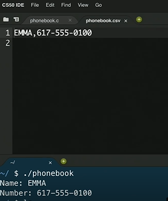

# 파일쓰기, 읽기

### 파일쓰기

사용자로부터 이름과 전화번호를 받아서 전화번호부를 만들어 보겠다.

```c
#include <cs50.h>
#include <stdio.h>
#include <string.h>

int main(void)
{
    // 파일을 연다.
    FILE *file = fopen("phonebook.csv", "a");

    // 사용자에게서 문자열을 입력받는다.
    char *name = get_string("Name: ");
    char *number = get_string("Number: ");

    // 파일을 출력한다.
    fprintf(file, "%s,%s\n", name, number);

    // 파일을 닫는다.
    fclose(file);

}
```

- <i>fopen</i>라는 함수를 이용하면 파일을 <i>FILE</i> 이라는 자료형으로 불러올 수 있다.

- FILE이라는 새로운 자료형을 가리키는 포인터 변수 file

- fopen의 첫 번째 인자로는 열고 싶은 파일 이름, 두 번째 인자로는 r(read), w(write), a(append)를 받는다.

- csv파일은 쉼표로 분리된 값이 들어있어서, 엑셀과 같은 프로그램으로 열 수 있다.

- <i>fprintf</i>는 파일용 printf로, 파일에 출력한다.

코드를 컴파일해서 실행하면 이름과 번호를 입력할 수 있다.
<br>
입력하게 되면 파일에 입력한 정보가 추가된다.



<br>

### 파일 읽기

주어진 파일의 형식이 JPEG인지 아닌지 확인해주는 프로그램 예제<br>
복습: [명령행 인자](https://github.com/leejaypower/TIL/blob/main/CS50/배열/명령행인자.md)

```c
#include <stdio.h>

int main(int argc, char *argv[])
{
    // 사용자가 프로그램 이름 말고 파일명도 입력해야 한다.
    if (argc != 2)
    {
        return 1;
    }

    FILE *file = fopen(argv[1], "r");
    // 사용자가 입력한 두 번째 문자열 arv[1], r은 read

    if (file == NULL)
    {
        return 1;
    }

    // 파일로부터 3바이트를 읽는다.
    unsigned char bytes[3];
    fread(bytes, 3, 1, file);

    // 읽은 3바이트가 다음과 같을 때 (JPEG파일의 조건)
    if (bytes[0] == 0xff && bytes[1] == 0xd8 && bytes[2] == 0xff)
    {
        printf("Maybe\n");
    }
    else
    {
        printf("No\n");
    }
    fclose(file);
}
```

- fopen, malloc, get_string 같은 함수는 에러가 생기면 NULL을 돌려준다.
- unsigned가 붙어서 0부터 255 범위의 값을 의미한다.
- fread 함수의 인자는 배열, 읽을 바이트 수, 읽을 횟수, 읽을 파일순이다.

<br>

이처럼 포인터를 배우게 되면 파일에 적을 수도, 읽을 수도 있다.<br>
참고로 JPEG 파일뿐만 아니라 다른 파일 형식도 그 형식임을 알려주는 File Signature라는 약속이 존재한다.

<br>
<hr>
<a href="https://www.boostcourse.org/cs112">모두를 위한 컴퓨터과학(CS50 2019)</a> - 파일 쓰기, 파일 읽기로 공부한 내용입니다.
