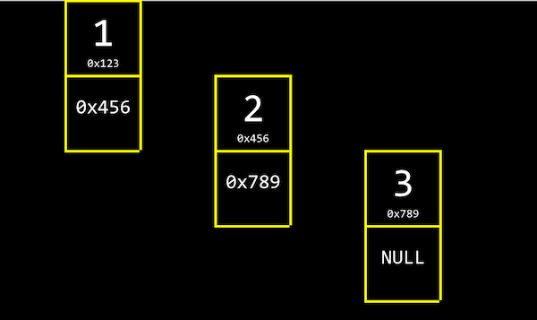

# 연결리스트

```
struct(구조체)
.
*
```

- struct: 이름과 번호가 들어있는 person 구조체와 같이 속성을 지정한 나만의 자료구조
- . : 구조체의 속성값 가져올 때 사용
- \* : 메모리 덩어리로 접근할 수 있는 역참조 연산자

<br>

배열의 장점

- 대괄호를 이용해서 문법적으로 쉽게 인덱싱이 가능하다.
- 일정한 시간에 접근할 수 있다. 즉, <i>랜덤 접근</i> 이 가능하다.

<br>

### 연결리스트



> <b>연결 리스트</b>는 메모리 덩어리 여러 개를 포함한 데이터 구조이다. 이 메모리들은 포인터로 연결되어 있다.

- 이 구조는 배열이 아니다. 1, 2, 3이 서로 인접해있지 않기 때문이다.

- 값들이 서로 붙어있지 않기 때문에 여기서는 대괄호를 사용할 수 없다.
- 1, 2, 3을 담아 리스트들을 정렬된 상태로 유지하기 위해 값을 저장한 메모리에 여유 공간을 추가해 일종의 <b>주소 역할</b>을 하게 한다.
- 메모리 덩어리는 그 다음 정렬할 메모리를 가리킨다.
- 리스트의 마지막 메모리 덩어리는 <b>NULL</b>을 가리켜 이 리스트에 더이상 남은 것이 없다고 나타낸다.
- NULL은 포인터이고 그 값은 0이다.

<br>

### 연결리스트의 구조체 정의

```c
typedef struct node
{
    int number;
    struct node *next;
}
node;
```

> 컴퓨터 공학에서 node의 의미는 직사각형으로 나타낼 수 있는 메모리 덩어리를 의미한다. 그리고 이를 여러 목적에 의해 사용할 수 있다.

- 이 연결리스트는 두 개의 필드를 갖고 있다.

- 하나는 정수타입으로 이름을 number라고 부르도록 하겠다.

- 또 다른 필드는 리스트의 다음 요소를 가리키는 메모리 덩어리로, 관례적으로 next라고 부른다.

- node 구조체가 정의되지 않은 시점에서 next node를 가리켜야하기 때문에 <i>typedef struct</i> 뒤에 <i>node</i>를 붙인다.

<br>

### 연결리스트의 구현

```c
#include <stdio.h>
#include <stdlib.h>

//연결 리스트의 기본 단위가 되는 node 구조체 정의
typedef struct node
{
    //node 안에서 정수형 값이 저장되는 변수 name
    int number;

    //다음 node의 주소를 가리키는 포인터 *next
    struct node *next;
}
node;

int main(void)
{

    // 연결 리스트의 가장 첫 번째 node를 가리킬 node 포인터 list
    // list를 NULL로 초기화. 현재 아무것도 가리키지 않음.
    node *list = NULL;

    // 새로운 node를 위해 메모리를 할당하고 포인터 n으로 가리킨다.
    node *n = malloc(sizeof(node));
    if (n == NULL)
    {
        return 1;
    }

    // n이 가리키는 node의 number 필드(속성)
    // (*n).number
    n->number = 1;

    // n 다음에 정의된 node가 없으므로 NULL로 초기화
    n->next = NULL;

    // 첫번째 node를 정의했기 떄문에 list 포인터를 n 포인터로 바꿔준다.
    list = n;

    // list에 node를 더 연결하기 위해 n에 새로운 메모리를 다시 할당
    n = malloc(sizeof(node));
    if (n == NULL)
    {
        return 1;
    }

    // n의 number와 next의 값을 각각 저장
    n->number = 2;
    n->next = NULL;

    // list가 가리키는 것은 첫 번째 node이다. 이 다음 node를 n 포인터로 지정한다.
    list->next = n;

    // 다시 한 번 n 포인터에 새로운 메모리를 할당하고 number과 next의 값을 저장
    n = malloc(sizeof(node));
    if (n == NULL)
    {
        return 1;
    }

    n->number = 3;
    n->next = NULL;

    // 현재 list는 첫번째 node를 가리키고, 이는 두번째 node와 연결되어 있다.
    // 따라서 세 번째 node를 더 연결하기 위해 첫 번째 node (list)의
    // 다음 node의 다음 node(list->next->next)를 n 포인터로 지정
    list->next->next = n;

    // 이제 list에 연결된 node를 처음부터 방문하면서 각 number 값을 출력
    // 마지막 node의 next에는 NULL이 저장되어 있고 이 것은 for 루프의 종료 조건이 된다.
    for (node *tmp = list; tmp != NULL; tmp = tmp->next)
    {
        printf("%i\n", tmp->number);
    }

    // list에 연결된 node들을 처음부터 방문하면서 메모리를 해제
    while (list != NULL)
    {
        node *tmp = list->next;
        free(list);
        list = tmp;
    }
}

```

- malloc을 사용해 메모리를 할당할 때는 항상 반환된 값을 체크해서 검사해야한다.

<br>

### 배열과 연결리스트

- 연결 리스트를 사용하면
  실제로 데이터가 연속되어있지 않아도 <b>연속된 데이터처럼 사용</b>할 수 있다.
- 연결 리스트는 배열처럼 연속된 빈 메모리 공간이 필요하지 않다.<br>
- 연결 리스트는 새로운 데이터를 리스트 중간에 삽입해야할 때도, 포인터만 바꾸면 되기 때문에 전체를 수정할 필요도 없다.
- 하지만 연결리스트는 정적구조인 배열과 다르게 임의 접근이 불가능하다.
- 연결 리스트에 특정 값을 검색하려면 그 값이 있는 위치까지 리스트의 node를 거쳐 이동해야 한다.
- 따라서 연결 리스트의 크기가 n일때 그 실행시간은 O(n)이 된다.

<br>
