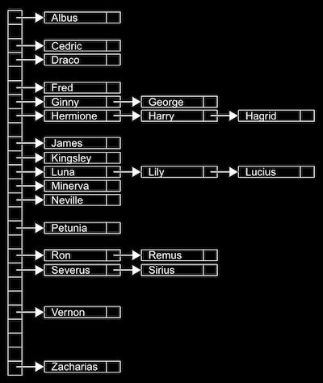

# 해시 테이블, 트라이

## 해시 테이블

일정한 실행 시간을 가지도록 해주는 자료 구조로 <b>해시 테이블</b>이 있다.

해시 테이블은 배열과 연결 리스트를 조합한 것으로, <b>연결리스트의 배열</b> 이라고 말할 수 있다.

> 해시 테이블에서는 단어나 이름같은 입력값이 들어온다면 그 단어에 포함된 문자를 보고 어디에 그 이름을 넣을지 결정하는 방식이 흔히 사용된다.

 

여러개의 값들은 <b>해시 함수</b>를 통해 여러 연결리스트에 나눠 담아진다. 그리고 이러한 여러개의 연결리스트의 집합이 해시테이블이다.

 

### 해시 테이블 예제

예를 들어, 사람들의 이름을 자료로 담기 위해 이름의 첫 글자별로 나눠 저장하려고 한다.  알파벳을 이용해 세로로 배열을 만들고, 중복되는 첫글자 값을 넣기 위해 가로로 연결 리스트를 만든다. 
이 때 해시 함수는 <i>이름의 가장 첫 글자</i> 이고, 최종적으로 저장되는 자료구조는 <i>해시 테이블</i> 이다.

- 인덱싱을 하는데 사용하는 배열이 해시 함수이다.
- 해시 함수는 어떤 함수이자, 과정이자, 알고리즘이다.
- 이상적인 해시 함수의 검색 시간은 O(1)이 된다.
- 하지만 단 하나의 배열칸에 모든 값들이 연결리스트로 이어져서 O(n)이 될 수도 있다.
- 일반적으로는 배열의 칸을 여러개로 나누기 때문에 O(1)에 가깝다.

 

배열 칸을 여러개로 나눌수록 검색 시간은 빨라지지만 그만큼 메모리가 많이 사용된다. 
따라서 시간과 공간의 균형을 찾는 것이 중요하다. 
이상적인 해시함수를 만들기 위해서는 일정한 기준을 통해 데이터가 최대한 고루 분배될 수 있게 하는 것이다.

## 트라이

 

<a href="https://www.boostcourse.org/cs112">모두를 위한 컴퓨터과학(CS50 2019)</a> - 해시 테이블로 공부한 내용입니다.
