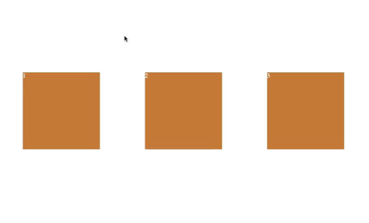
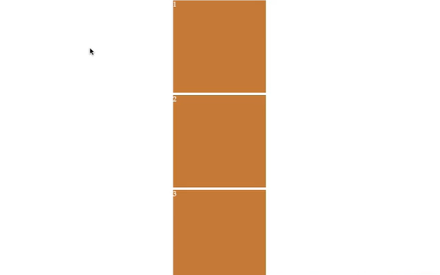
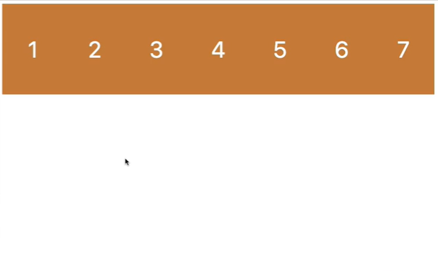
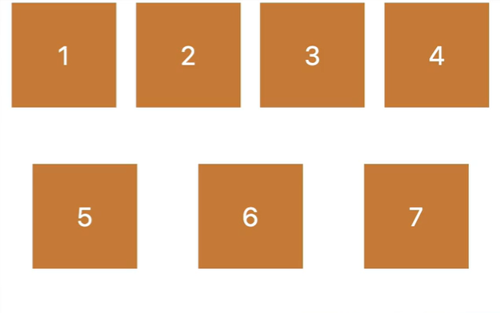
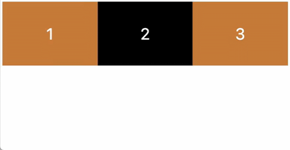
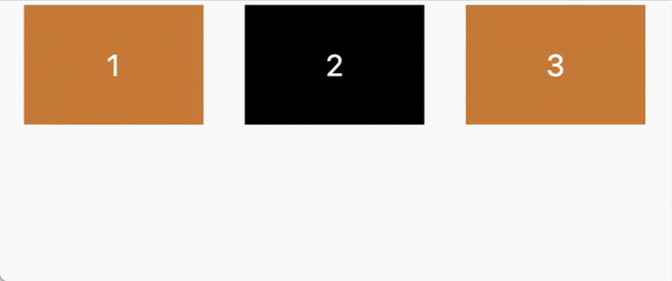
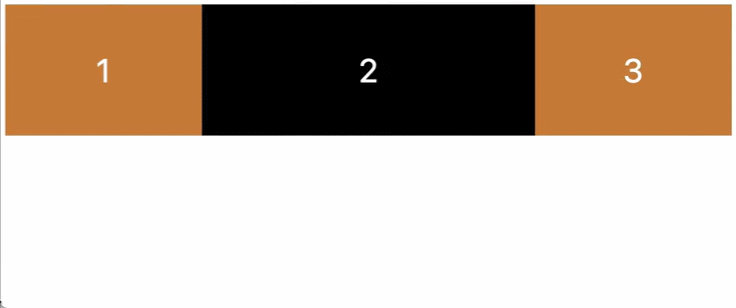

# flexbox

### flexbox container

<b>flexbox에서는 children과 이야기하지 않는다.</b>

- flexbox에서 뭔가를 움직이고 싶을 때는 <i>flexbox container</i>를 만들어야 한다.

```html
<html>
  <head>
    <title>CSS Masterclass</title>
  </head>
  <body>
    <div class="wrapper">
      <div class="box">1</div>
      <div class="box">2</div>
      <div class="box">3</div>
    </div>
  </body>
</html>
```

```css
.wrapper {
  display: flex; /* flexbox container */
}
.box {
  width: 200px;
  height: 200px;
  background: peru;
}
```

- 유의할 점은 바로 위의 부모의 display가 flex여야 한다.

<br>

### flex-direction

- flex container의 flex-direction 기본 값은 <b>row</b>이다.

```css
.wrapper {
  display: flex;
  flex-direction: row; /* 기본값 - 자식을 수평으로 정렬 */
                  column /* 자식을 수직으로 정렬 */
  justify-content: center; /* 메인축에서 가운데 정렬 */
}
```

<br>

### flexbox의 axis

flex-direction: <b>row</b>일 때, <b>horizontal(가로축)이 main-axis(메인축)</b>이고, <b>cross axis는 vertical(세로축)</b>이다.

  

<small>이미지 출처: [W3C](https://www.w3.org/TR/css-flexbox-1/#box-model)</small>

- <b>main axis</b> 방향으로 item을 옮기기 위해서는 <b>justify-content</b>를 사용한다.
- <b>cross axis</b> 방향으로 item을 옮길 때는 <b>align-items</b>를 사용한다.

<br>

```css
.wrapper {
  display: flex;
  flex-direction: row;
  /* Main Axis */
  justify-content: space-around;
  /* Cross Axis */
  align-items: center;
  height: 100vh;
  /* 부모의 높이를 정하지 않으면 align-items:center가 소용이 없다는 것을 유의
 */
}
```



<br>

<br>

flex-direction: <b>column</b>의 경우, <b>main axis는 vertical(세로축)</b>이며, <b>cross axis는 horizontal(가로축)</b>이다.

```css
.wrapper {
  display: flex;
  flex-direction: column;
  /* Main Axis */
  justify-content: space-around;
  /* Cross Axis */
  align-items: center;
  height: 100vh;
  /* 부모의 높이를 정하지 않으면 align-items:center가 소용이 없다는 것을 유의
 */
}
```


<small>화면 캡처상 이미지에는 잘렸지만 1번 box의 위와 3번 box 아래에는 공간이 더 있다. </small>

<br>

<b>justify-content와 align-items의 사용을 헷갈리지 않으려면 main axis와 cross axis가 어디에 있는지 알아야 한다.</b>

<br>

### align-self

- <b>align-self</b>는 align-items와 같이 cross axis축으로 정렬하는 일을 한다.
- 다만 부모가 자식을 옮기는 것이 아니라 <b>자식 아이템을 골라서 직접 위치를 변경할 때 사용한다.</b>
- 이 때 움직이는 아이템의 부모에게 크기를 주지 않으면 작동하지 않는다는 것을 유의한다.

```css
.box:nth-child(2) {
  align-self: center;
}

.box:nth-child(3) {
  align-self: flex-end;
}
```

<br>

### order

- <b>order</b>는 box에게 순서를 변경하라고 할 수 있다.<br>
- order의 기본값은 0이다.

```css
.box:nth-child(2) {
  order: 1;
}
```

- 이러면 두 번째 자식이 마지막 순서가 된다.
- 첫 번째, 세 번째 자식은 order가 0이고, 두 번째 자식만 order가 1이 되기 때문이다.
- order로 설정한 숫자가 높은 만큼 순서가 밀린다.
- order는 HTML을 바꿀 수 없을 때 유용하다.

<br>

### flex-wrap

flexbox는 item들이 너비가 바뀌더라도 모두 같은 줄에 있도록 유지하는 특성이 있다.<br>

```html
<html>
  <head>
    <title>CSS Masterclass</title>
  </head>
  <body>
    <div class="wrapper">
      <div class="box">1</div>
      <div class="box">2</div>
      <div class="box">3</div>
      <div class="box">4</div>
      <div class="box">5</div>
      <div class="box">6</div>
      <div class="box">7</div>
    </div>
  </body>
</html>
```

```css
.wrapper {
  display: flex;
  justify-content: space-around;
  height: 100vh;
  flex-wrap: nowrap; /* 기본값 */
}
.box {
  display: flex;
  width: 200px;
  height: 200px;
  background: peru;
  justify-content: center;
  align-items: center;
}
```



<br>

<b>flex-wrap : wrap;</b> 을 사용하면 item의 설정된 크기를 유지한다.



<br>

### align-content

- <b>align-content</b>는 <b>wrap을 사용해 아이템을 정렬할 때</b> 줄바꿈이 생기면 줄 사이와 주변에 빈 공간이 생기는데, 이를 조절할 때 사용한다.<br>
- <b>justify-content와 비슷하지만 cross axis에서의 item 주변 공간에 관한 것이다.</b><br>
- <i>따라서 nowrap 상태에서는 아무 일도 일어나지 않는다.</i>

```css
.wrapper {
  align-content: normal /* 기본값으로 너비를 무시하고 한 줄로 배치함 */
                 flex-start; /* item 간격이 없어지고 cross axis 시작점에 배치함 */
                 flex-end; /* item 간격이 없어지고 cross axis 끝점에 배치함 */
                 center; /* item 간격이 없어지고 가운데로 정렬됨 */
                 space-between; /* cross axis의 시작점부터 끝점까지 아이템의 간격을 동일하게 맞춰 배치 */
                 space-around; /* cross axis에 따라 첫 여백과 아이템 간격, 끝 여백을 동일하게 맞춰 배치 */
                 ...
}
```

<br>

### flex-shrink & flex-grow

flex-wrap이 nowrap일 때, 한 줄에 아이템들이 들어가기 위해 너비가 무시될 수 있다.<br>
이 때 <b>flex-shrink</b>는 element의 행동을 정의하는데, <b>어떤 flex item이 너비가 더 줄어들지를</b> 정할 수 있다.

```css
.box:nth-child(2) {
  background: #000;
  flex-shrink: 1; /* 기본값 */
               2; /* 너비가 무시되는 시점에서 다른 item보다 2배 더 줄어든다.*/
}
```



<br>
<br>

<b>flex-grow</b>는 item들이 한 줄로 정렬되어 있을 때 남아있는 빈 공간을 가져와서 너비를 늘릴 수 있는 만큼 늘린다.


```css
.box:nth-child(2) {
  background: #000;
  flex-shrink: 0; /* 기본값 */
               1;
}
```

- flex-grow의 기본값은 0이다.
- 화면이 작아지면서 존재했던 빈 공간이 줄어들면 grow로 인해 늘어났던 너비는 줄어든다.

  

- 한 item에만 grow를 준다면, 그 item이 모든 여분의 공간을 차지하기 때문에 설정하는 숫자가 1이던지 2이던지 의미가 없다.
- 하지만 여러 item에 grow 값을 준다면 빈 공간의 분배 비율에 따라 값을 주면 된다.

이러한 속성은 반응형 디자인을 위해 유용하게 쓰일 수 있다.

<br>

### flew-basis

<b>flex-basis</b>는 grow나 shrink 되기 전에 element에게 기본 크기를 주는 것이다.<br>
<b>flex-basis는 main axis에서 작용하기 때문에</b> width와 같을 수도, height와 같을 수도 있다.

```css
.box{
  flex-basis: auto /* 기본값 */
              300px;
              30%; /* 부모의 크기가 설정되있는 경우 %단위도 가능하다. */
  background: peru;
  color: white;
  font-size: 50px;
}
```

> flex-basis가 auto가 아닐 때 width나 height(main axis에 따라)를 동시에 적용한 경우 flex-basis가 우선이다.

<br>
<hr>
<a href="https://nomadcoders.co/css-layout-masterclass">노마드코더 CSS Layout 마스터클래스</a> - flexbox로 공부한 내용입니다.
