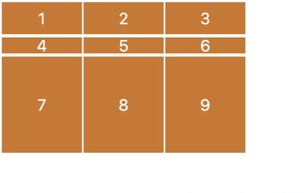
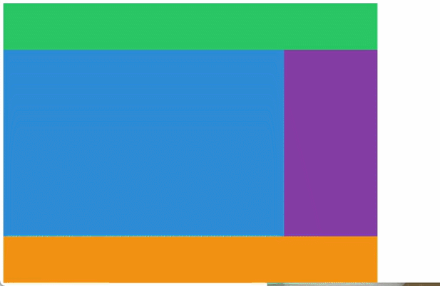
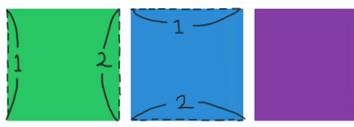
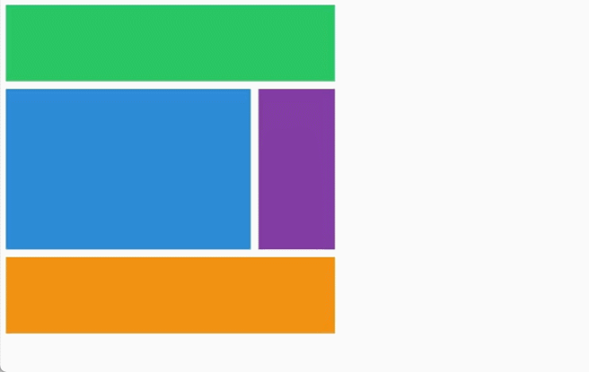
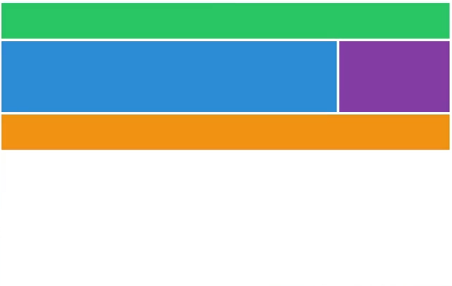
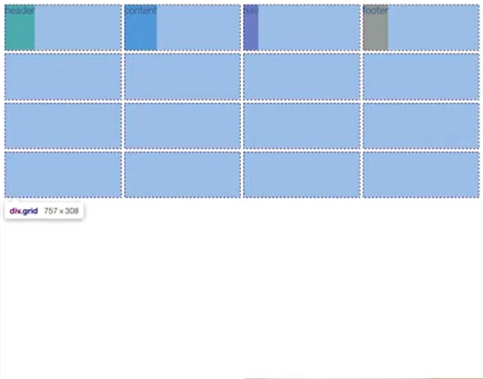
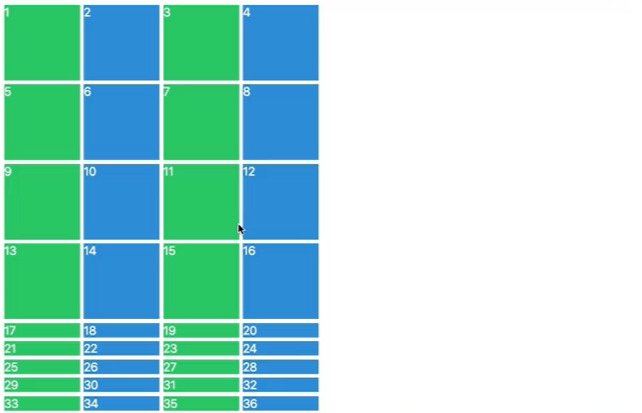
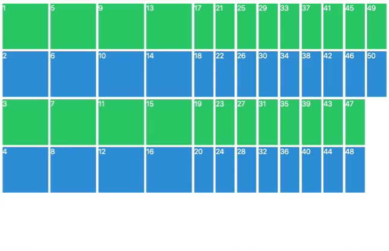

# grid

flexbox와 마찬가지로 grid로 item을 배치하려면 부모의 display가 grid여야 한다.



<br>

```html
<html>
  <head>
    <title>CSS Masterclass</title>
  </head>
  <body>
    <div class="wrapper">
      <div class="box">1</div>
      <div class="box">2</div>
      <div class="box">3</div>
      <div class="box">4</div>
      <div class="box">5</div>
      <div class="box">6</div>
      <div class="box">7</div>
      <div class="box">8</div>
      <div class="box">9</div>
    </div>
  </body>
</html>
```

```css
.wrapper {
  display: grid; /* grid container */

  grid-template-columns: 250px 250px 250px;
  grid-template-rows: 100px 50px 300px;
  /* grid의 행(row)과 열(column)의 개수와 크기 설정 */

  /* 빈 공간 설정 */
  column-gap: 5px;
  row-gap: 10px;

  /* column과 row의 gap을 gap 하나로 설정 가능 */
  /* gap: 10px; */
}

.box {
  width: 200px;
  height: 200px;
  background: peru;
  color: white;
}
```

<br>

## grid area

grid로 layout을 구성할 때, grid-template-areas를 사용할 수 있다.



<br>

```html
<html>
  <head>
    <title>CSS Masterclass</title>
  </head>
  <body>
    <div class="grid">
      <div class="header"></div>
      <div class="content"></div>
      <div class="nav"></div>
      <div class="footer"></div>
    </div>
  </body>
</html>
```

```css
.grid {
  display: grid;
  grid-template-columns: repeat(4, 200px);
  /* grid-template-columns: 200px 200px 200px 200px; 와 같다 */

  grid-template-rows: 100px repeat(2, 200px) 100px;
  /* 첫번째 행과 마지막 행은 100px */

  /* 시각적으로 layout을 디자인한다. */
  grid-template-areas:
    "header header header header"
    "content content content nav"
    "content content content nav"
    "footer footer footer footer";
}
.header {
  background-color: green;
  grid-area: header;
}
.content {
  background-color: lightblue;
  grid-area: content;
}
.nav {
  background-color: purple;
  grid-area: nav;
}
.footer {
  background-color: gray;
  grid-area: footer;
}
```

- repeat 함수는 반복되는 열의 수, 크기를 인자로 받는다.
- grid로 layout을 디자인하기 위해서는 이름을 작성해야 한다.
- grid-area의 이름과 grid-template-areas의 이름이 같아야 한다.
- <i>이 때 class 이름은 grid-template-areas와는 상관이 없다.</i>
- grid-template-areas 적용할 때 주의할 점은 <b>영역을 나눌 때, 같은 영역은 사각형의 형태로 이어져야 한다.<br>(ㄱ, ㄴ 모양으로 이어질 수 없음)</b>

<br>

## grid row and columns

column과 row만을 사용해서 layout을 구성할 수도 있다.

```css
.grid {
  display: grid;
  gap: 10px;

  grid-template-columns: repeat(4, 100px);
  grid-template-rows: repeat(4, 100px);
}
.header {
  background-color: green;
  grid-column-start: 1;
  grid-column-end: 2;
  /* column이 아니라 line으로 생각해야 한다. 즉 column의 첫번째 줄에서 시작하고 두 번째 줄에서 끝난다. */
}
.content {
  background-color: lightblue;
}
.nav {
  background-color: purple;
}
.footer {
  background-color: gray;
}
```

- header에게 column과 row가 어디서 시작하고 끝날지 알려줄 수 있다.
- 이때 grid-column의 시작과 끝은 column의 개수가 아니라 column의 line으로 생각해야 한다.
- 한 column box의 왼쪽 줄이 첫째 줄, 오른쪽 줄이 둘째 줄이다.
- 마찬가지로 grid-row의 시작과 끝은 row 박스의 위쪽 줄이 첫째 줄, 아래 쪽 줄이 둘째 줄이다.

  

<hr>
<br>


```css
.grid {
  display: grid;
  gap: 10px;

  grid-template-columns: repeat(4, 100px);
  grid-template-rows: repeat(4, 100px);
}
.header {
  background-color: green;

  grid-column: 1 / 5;
  /* grid-column-start: 1;
  grid-column-end: 5; */
}
.content {
  background-color: lightblue;

  grid-column: 1 / -2;
  /* grid-column: 1 / 4 */

  grid-row: 2 / span 2;
  /* grid-row: 2 / 4; */
}
.nav {
  background-color: purple;

  grid-row: 2 / 4;
}
.footer {
  background-color: gray;

  grid-column: span 4;
  /* grid-column: 1 / -1; */
  /* grid-column: 1 / 5; */
}
```

- grid의 start, end 특성은 html의 변경없이 element의 모습을 바꿀 때도 유용하다.
- <b>start와 end를 작성할 때 / 를 사용하여 코드 작성을 줄일 수 있다.</b>
- line 수가 몇개인지 하나하나 셀 필요 없이 시작과 끝을 적는 방법이 있다.
- -1 은 끝이라는 의미이다.
- <b>끝인 -1에서부터 처음으로 가는 방향으로 -2, -3, -4... 처럼 작성할 수 있다.</b>
- span을 사용하는 방법도 있다.
- <b>span은 시작점과 끝점을 작성하는 것을 대신해서, 얼마나 많은 cell을 갖는지를 적는다.</b>

- span을 시작점이나 끝점작성과 혼용해서 쓸 수 있다.

<hr>
<br>

각 line에 이름을 붙일 수도 있다.

```css
.grid {
  display: grid;
  gap: 10px;

  grid-template-columns: [first-line] 100px [second-line] 100px [third-line] 100px [fourth-line] 100px;
  grid-template-rows: repeat(4, 100px [jay-line]);
  /*  grid-template-rows: 100px [jay-line] 100px [jay-line] */
}
.content {
  background-color: lightblue;

  grid-column: first-line / fourth-line;
  /* grid-column: 1 / 4 */

  grid-row: jay-line 1 / jay-line 3;
  /* grid-row: 2 / 4; */
}
```

- 위 예처럼 repeat 함수에 네이밍을 할 수도 있다.

<br>

## fr

fr은 fraction(부분)이라는 뜻으로, 하나의 측정단위이다.<br>

- <b>fr은 grid container에서 사용 가능한 공간을 말한다.</b><br>
- fr은 보이는 화면에서의 공간을 분배하기 때문에 반응형 디자인에 아주 유용하다.

```css
.grid {
  display: grid;
  gap: 10px;
  height: 50vh;

  grid-template-columns: repeat(4, 1fr);
  /* 사용 가능한 공간에서 4개의 column을 만든다. */
  /* grid-template-columns: 1fr, 1fr, 1fr, 1fr */

  grid-template-rows: repeat(4, 100px);
}
```

- fr 앞에 원하는 숫자를 붙이면 원하는 비율로 배치할 수 있다. 2fr, 3fr, 4fr...
- rows에 fr을 사용하려면 grid container에 높이를 지정해 주는 일을 잊지 말아야 한다.
- block에 width가 주어지지 않은 경우 최대값을 갖지만, height는 0을 갖기 때문이다.

<br>

## grid-template

grid-template는 위에서 배운 grid-template-areas, grid-template-columns grid-template-rows를 더 간략하게 사용하게 해준다.



```css
.grid {
  display: grid;
  gap: 10px;
  height: 50vh;
  grid-template:
    "header header header header" 1fr
    "content content content nav" 2fr
    "footer footer footer footer" 1fr / 1fr 1fr 1fr 1fr;
  /* "영역을 정함(하나의 row)" row의 높이 / column의 폭(width)  */
}
.header {
  background-color: green;

  grid-area: header;
}
.content {
  background-color: lightblue;

  grid-area: content;
}
.nav {
  background-color: purple;

  grid-area: nav;
}
.footer {
  background-color: gray;

  grid-area: footer;
}
```

- <b>grid template에서 repeat 함수는 사용할 수 없다!</b>
- column의 폭을 작성하지 않으면 grid가 가질 수 있는 화면에서의 최대 너비를 가진다.
- fr 덕분에 화면 크기가 변해도 비율은 똑같다.

<br>

## place items

```css
.grid {
  display: grid;
  gap: 5px;
  height: 50vh;
  grid-template-columns: repeat(4, 1fr);
  grid-template-rows: repeat(4, 1fr);

  justify-items: stretch; /* 기본값  */
                 start;
                 center;
                 end;
                 ...
  align-items :  stretch; /* 기본값 */
                 start;
                 end;
                 ...

  place-items : stretch  center;
          /* align-items / justify-items */
}
.header {
  background-color: green;
}
.content {
  background-color: lightblue;
}
.nav {
  background-color: purple;
}
.footer {
  background-color: gray;
}
```

- justify-items는 수평으로 아이템을 정렬한다. 기본값은 stretch.
- <b>여기서 item은 grid cell 하나하나를 의미한다.</b>

- stretch는 grid-container가 grid를 갖고 있을 때 grid를 늘여서 grid 자체를 채우도록 한다.
- justify-items로 다른 조건(start, end...)을 주면 grid 내용물의 위치는 달라보이지만 여전히 같은 크기의 column과 row를 갖고있다.
  

- align-items은 flexbox와 마찬가지로 수직으로 아이템을 정렬한다.

- 높이와 너비가 정해져 있지 않고, grid속 item의 내용물이 아무것도 없다면 화면에 나타나지 않는다.

- item(grid container안의 div)에 높이와 너비를 주면 grid 박스 안에서 존재하고 움직인다.

- <b>place-items는 justify-items와 align-items의 작성을 간략하게 해준다.(shortcut)</b>

<br>

## place content

```css
.grid {
  display: grid;
  gap: 5px;
  height: 50vh;
  grid-template-columns: repeat(4, 100px);
  grid-template-rows: repeat(4, 100px);

  justify-content: center;
                   space-around;
                   space-evenly;
                   space-between;
                   ...
  place-content:   center  start;
                  /* justify-content / align-content */
}
```

- <b>grid container에서 content는 전체 grid를 의미한다.</b>

- grid에는 전체 grid를 정렬하는 justify-content, align-content가 있다.

<br>

```css
.header {
  background-color: green;
  place-self: center start;
  /* justify-self / align-self */
}
.content {
  background-color: lightblue;
}
.nav {
  background-color: purple;
}
.footer {
  background-color: gray;
}
```

- place self(justify-self, align-self)는 grid container의 child에만 적용되는 property이다.
- place-content로 적용된 것을 무시하고 개별적으로 움직인다.

<br>

## Auto Columns and Rows

server에서 데이터를 가져와서 나타낼 경우, grid-template의 column이나 row를 데이터의 양만큼 동적으로 지정하지 않는다면 디자인이 무너질 것이다.

<b>grid-auto-rows는 만약 더 많은 content가 있다면 따로 rows를 지정해 주지 않아도 default value를 자동으로 줘서 row를 생성한다.</b>

```css
.grid {
  display: grid;
  gap: 5px;
  height: 50vh;

  grid-template-columns: repeat(4, 100px);

  /* 특정 row의 수의 크기를 지정함 */
  grid-template-rows: repeat(4, 100px);

  /* row의 default size를 지정함 */
  grid-auto-rows: 100px;
}
```

- 특정 row의 수의 크기를 지정하지 않는다면 grid-auto-rows의 설정값으로 모든 row들이 자동화된다.

- 만약 grid-auto-rows를 주지 않고 4개의 row만 크기를 지정했는데 row가 5개 이상이라면, 나머지 row들은 사이즈가 없는 div로 생성되어 4열로 세워진다.

  

<br>

여분의 데이터를 새로운 row를 생성하는 대신 새로운 column을 만들고 싶다면 <b>grid-auto-flow</b>를 사용한다.

```css
.grid {
  display: grid;
  gap: 5px;
  height: 50vh;

  grid-template-columns: repeat(4, 100px);
  grid-template-rows: repeat(4, 100px);

  grid-auto-flow: column;
                  row; /* 기본값 */

  grid-auto-columns: 100px;
}
```

- gird-auto-flow를 사용하면 지정된 row의 수 보다 더 많은 div가 있을 때마다 지정된 row에(예제에서는 4행) 맞춰 사이즈가 없는 column을 만든다.

- column의 기본 크기를 지정하고 싶다면 grid-auto-columnns를 사용한다.

- 여기서 주의할 것은 div의 순서가 column을 따라 좌에서 우로 가는 것이 아니라 위에서 아래로 향한다는 것이다.

  

- 마치 flexbox의 direction이 column이 되는 것과 같다.

<br>
