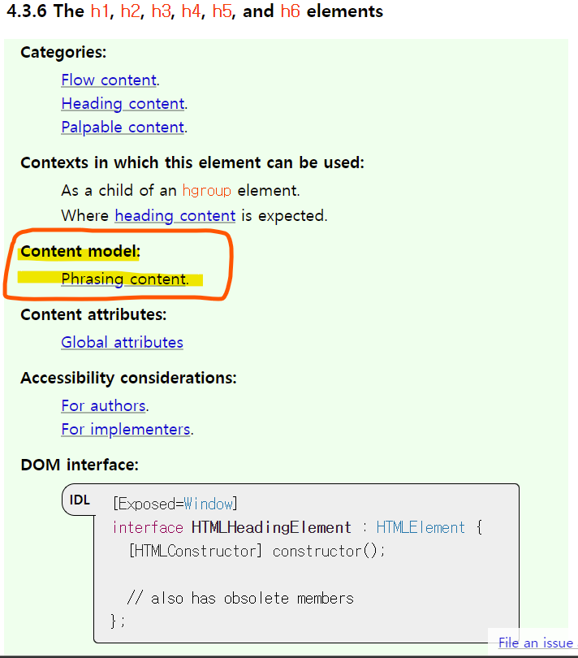

# HTML 살펴보기

### HTML 기본 템플릿

```html
<!DOCTYPE html>
<!-- HTML 버전 명시 -->
<html lang="ko">
  <head>
    <!-- Document Metadata -->
    <!-- 다른 문서나 다른 머신에게 이 문서에 대한 정보를 제공하는 데이터 -->
    <meta charset="UTF-8" />
    <!-- 특정 언어의 깨짐을 방지 -->
    <meta name="viewport" content="initial-scale=1, width=device-width" />
    <!-- 문서가 렌더링될때 어떤 식으로 렌더링 되는지 결정 -->
    <title>Document Title</title>
  </head>
  <body>
    <!-- 이 문서의 핵심 내용 -->
    <!-- 기본적으로 유저의 눈에 보임 -->
    <!-- document의 아웃라인이 그려지거나, 검색 엔진이 데이터를 긁어가는 등의 많은 작업이 수행되는 곳 -->
  </body>
</html>
```

<br>

## DOCTYPE

> DOCTYPE은 HTML, XML, SGML, SVG 등 다양한 마크업 기반 언어에서 사용되며, 문서의 타입과 버전을 나타낼 때 사용한다.<br>DOCTYPE은 항상 해당 문서의 1번째 줄에서 작성한다.

<br>

### DOCTYPE 선언의 중요성

- 브라우저가 해당 문서를 읽을 때 DOCTYPE을 먼저 읽고 이 문서가 어떤 버전인지를 판단한다.

- DOCTYPE을 선언하지 않으면, Quirks mode라는 하위 호환성 모드로 읽는다.

- 그렇게 되면 예상치 못한 동작이 발생할 수 있고 브라우저의 구현 상황에 따라 조금씩 상이하게 동작한다.

- 이메일에서 사용하는 HTML을 작성할 때는 Quirks mode를 의도적으로 사용한다.<br> 웹 페이지에서 embed되는 구조를 취하기 때문에 예외적이다.

<br>

## Content model

콘텐츠 모델은 모든 HTML요소가 가지고 있으며 어떤 요소의 부모나 자식관계를 나타낼 때 보통 콘텐츠 모델로 추정할 수 있다.

일부 케이스에서는 콘텐츠 모델만으로는 파악하기 어려운 경우도 있으나,<br> 대부분의 경우 콘텐츠 모델 만으로도 이 요소가 어떤 동작을 하는지 유추가 가능하다.

<br>



<br>

### content model의 카테고리

- <b>Metadata content</b> : 메타 데이터 콘텐츠는 웹 페이지 내에서 나머지 콘텐츠의 동작이나 표현을 정의하거나,<br> 다른 문서와 이 문서 간의 관계를 나타내고 이 문서에 대한 정보를 표현할 때 사용한다.

  ```
  -Base  -style  -link  -template  -meta  -title
  -script  -noscript
  ```

  <br>

- <b>Flow content</b> : 문서의 body 요소에 들어갈 수 있는 대부분의 요소는 Flow 콘텐츠에 속한다.

 <br>

- <b>Sectioning content</b> : heading과 footer의 범위를 정하는 콘텐츠이다.

  ```
  -article  -aside  -nav  -section
  ```

   <br>

- <b>Heading content</b> : 섹션의 헤더를 정의한다. 섹션의 헤더에는 명시적으로 Sectioning content를 사용하는 것과, 암묵적인 것이 있다.<br>
  (div요소를 사용했는데, 그 안에 heading요소를 사용하게 되면 heading요소가 암묵적으로 섹션에 생성하게 된다)

 <br>

- <b>Phrasing content</b>: HTML 문서 내에서 텍스트를 표시하는 요소이다. Text 노드를 포함하는 경우가 대부분 해당된다.

 <br>

- <b>Embedded content</b> : 문서 내에서 외부 콘텐츠를 가져올 때 사용한다. 이미지, 비디오, 오디오, 외부 문서 등을 가져올 수 있다.

  ```
  -audio  -mathML  -canvas  -Object
  -embed  -picture  -iframe  -svg  -img  -video
  ```

<br>

- <b>Interactive content</b>: 유저와 상호작용이 발생하는 모든 요소를 의미한다.<br>
  일반적으로 interactive content 안에 다른 interactive content를 넣을 수 없다. <br>
  괄호가 있는 경우, 괄호 안 속성명이 있는 경우에만 interactive content로 취급된다.

  ```
  -a (href)  -ifram  -textarea  -audio (controls)  -img (usemap)  -video (controls)
  -input   -button   -label   -details   -select
  ```

- <b>Palpable content</b> : Flow 콘텐츠나 Phrasing 콘텐츠는 자식 노드가 적어도 1개 이상 존재해야 하며,<br> 만약 콘텐츠가 자식 노드를 가지지 않거나 숨김 상태인 경우 Palpable content라 지칭한다.

<br>

- <b>Script-supporting content</b> : 그 자체로는 무언가를 표현하지 않고, 스크립트를 지원하기 위해 사용하는 요소이다.

  ```
  -script  -template
  ```

<br>

- <b>Transparent content model</b> : 어떤 콘텐츠에 속하느냐에 따라 콘텐츠 모델이 달라진다.<br>
  예를 들어 a요소가 transparent 콘텐츠를 지니고 있는데, a요소가 p요소 내부에 있는 경우 콘텐츠 모델은 Phrasing content처럼 취급된다.<br>
  a 요소처럼 다양한 용법을 가지고 있는 요소는 용법에 따라 어디에서 사용될지가 달라지기 때문에 부모 요소의 콘텐츠 모델을 따라간다.

<br>

- <b>Paragraphs</b> : Paragraph는 콘텐츠 모델은 아니지만 Flow 콘텐츠 내에 텍스트가 들어가 있거나, Phrasing content가 여럿 묶여 있는 경우 Paragraph라고 취급하게 된다.

  ```html
  <section>
    <h1>Paragraph 소개</h1>
    이 문장은 section 요소 내의 첫번째 문장입니다.
    <!-- 위 문장은 Paragraph로 명시하진 않았지만 section 요소 내에서 text로 취급되고 있기 때문에 Paragraph로 취급된다. -->
    <p>이 문장은 section 요소 내의 두번째 문장입니다.</p>
    <!-- 위 문장은 Paragraph이다. -->
  </section>
  ```

  - section의 첫번째 문장은 암묵적인 동작을 하는데, 이처럼 보이지 않는 요소는 사용하지 않는 것이 좋다. \<p>태그로 감싸는 것이 좋다.

<br>

- <b>The nothing content model</b> : 일부 요소는 자식 노드를 전혀 포함하지 않는 경우도 존재한다.

<br>

이처럼 HTML 내의 모든 요소는 콘텐츠 모델을 가진다. <br>
하나의 요소가 여러 카테고리(모델)를 지닐 수 있으며, 스펙 내에서 콘텐츠 모델이 보통 이 요소의 포함관계를 보여준다.<br>
일부 요소들의 콘텐츠 모델은 <i>콘텐츠 포함관계에 따라</i>&nbsp; 달라질 수 있다.

<br>

## HTML 문법

```HTML
<!DOCTYPE html>
<html lang="ko">
  <head>
    <meta charset="UTF-8" />
    <meta name="viewport" content="initial-scale=1, width=device-width" />
    <title>Document Title</title>
  </head>
  <body>
    <!-- 태그 -->
    <!-- div 요소의 여는 태그 -->

    <!-- 속성명, 속성값 -->
    <!-- class 속성의 값을 "section"으로 넣어주었다. -->
    <div id="hello" class="section">

      <!-- 속성명과 속성값이 동일한 경우는 생략이 가능하다. -->
      <input readonly="readonly">
      <input readonly>

    <!-- div 요소의 닫는 태그 -->
    </div>
  </body>
</html>
```

<br>
<hr>
<a href="https://www.inflearn.com/course/html-%ED%91%9C%EC%A4%80-%EA%B8%B0%EC%B4%88">인프런 조은님의 HTML 강의</a> 로 공부한 내용입니다.
