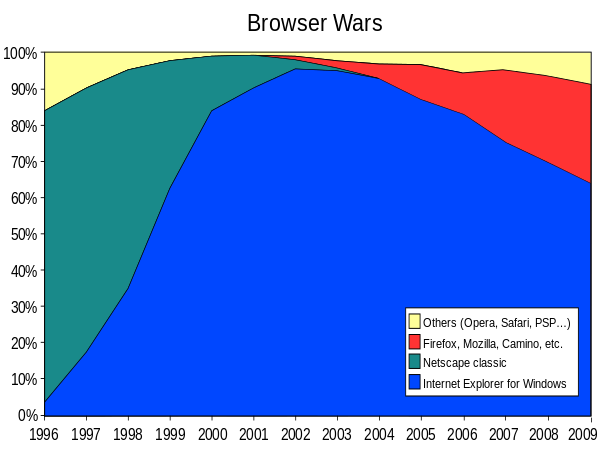

# 웹 표준

## 브라우저 전쟁

- 최초의 html이 나오면서 MOSAIC(모자이크)라는 브라우저가 나오게 되었다.

- 웹 프로그래밍 언어는 브라우저 위에서 존재하기 때문에 브라우저의 존재는 중요하다.

- 모자이크에 이어서 Netscape(넷스케이프)에서 Navigator(네비게이터)라는 브라우저를 만들게 된다.

- 네비게이터는 모자이크에 이어서 가장 유명하고 전세계에서 많이 쓰이는 브라우저로 자리매김하게 된다.

- 이후 Internet Explorer가 나오면서 브라우저 시장이 IE와 Navigator로 양대산맥을 이루게 된다.

- 예전에는 OS를 설치하면 브라우저가 기본적으로 탑재되어있지 않기 때문에 Navigator를 사람들이 많이 썼다.

- Microsoft의 Windows95 이후부터 IE를 탑재하게 되면서 이 기점으로 IE의 점유율이 급격하게 성장한다.

- 경쟁이 심화되는 와중에 IE에서 자체 기술을 만들게 되는데, 대표적인 것이 JScript로, IE에서만 동작하는 script가 있다.(비표준 기술)

- 또한 flash player가 브라우저에서 많이 사용되면서 웹 표준이라는 것이 중요하지 않게 인식되는 때가 있었다.

- 이 브라우저 전쟁에서 IE는 90%에 육박하는 점유율로 승리를 거두게 되고, 패배한 넷스케이프는 Mozilla를 만들고, firefox라는 브라우저를 만들게 된다.

- 웹 표준의 시작은 firefox로부터 시작되었기 때문에, firefox의 탄생은 중요한 의미를 갖고 있기도 하다.

 

## 웹 표준(Web Standard)

> 웹 표준은 \<section>요소를 사용하였을 때 모든 브라우저에서 동일한 동작을 기대할 수 있어야 한다.

<b>웹 표준</b>은 기술 표준을 작성하고, 브라우저들이 해당 표준을 준수하여 개발자가 기대한 결과를 얻게 한다.

> <b>웹 표준 프로젝트</b>는 브라우저 및 개발자들에게 웹 표준 준수에 대한 경각심을 일으키고 모든 브라우저에서 동일한 사용성을 제공할 수 있게 하자는 운동이다.

웹 표준 프로젝트는 <b>모든 사람들이 웹 기술을 잘 활용할 수 있도록</b> 웹 표준을 많은 사람들이 지원해주었으면 좋겠다는 취지로 시작되었다.

표준화기구 중 대표적인 기구는 W3C, WHATWG등이 있다.

- W3C 표준은 몇가지 단계를 거쳐서 만들어지며, 단계를 거치면서 문서가 성숙해진다.

- W3C의 표준을 브라우저 제조사나 개발자들이 따를 것을 <i>권장한다</i>.

- 2013년에 접어들면서 웹 표준 프로젝트는 공식적으로 마무리 되었다.  이러한 배경에는 Chrome의 등장, IE의 점유율의 하락 등이 있다.

 

## 표준화 기구

> 표준화 기구는 기술 표준을 만들어 여러 제조사와 기관들이 해당 표준을 준수한 제품을 만들었을 때, 사용자들이 해당 표준을 지키는 것만으로도 해당 제품을 사용할 수 있게 한다.

 

- 표준화 기구목록
  - W3C
    - WICG
  - WHATWG
  - ECMA International
    - TC 39
  - IETF
  - ISO

 

### W3C

W3C는 1994년 부터 시작된 현재 가장 큰 웹 표준화 기구이다.

- W3C가 관리하는 표준

  - CSS
  - MathML
  - EmotionML
  - Payment
  - Authentication
  - Linked Data
  - ETC...

 

- W3C 산하의 커뮤니티 그룹으로 WICG가 있는데, 신규 스펙들을 제안하고 관리하는 그룹이다.

 

### WHATWG

WHATWG는 2004년 Apple, Mozilla foundation, Opera Software가 모여서 만든 표준화 기구이다.

주로 웹 에플리케이션과 관련있는 스펙들을 많이 제어하는 편이다.

- WHATWG가 관리하는 표준
  - HTML Living Standard
  - DOM
  - Encoding
  - Fetch
  - Notification
  - Fullscreen API
  - ETC...

 

### ECMA International

ECMA는 1961년 시작된 유럽 기반의 표준화 기구이며, 현재는 전세계 표준을 제작하고 관리한다.

- ECMA International의 표준

  - ECMAScript (Javascript)
  - ECMAScript Internaliztion API
  - JSON
  - Dart Programming Language

 

- ECMA International의 산하조직으로는 TC 39가 있는데, Javascript 표준을 정의하고 관리하고 논의한다.

 

### IETF

IETF는 인터넷 기술에 사용 가능한 표준을 부여한다.

- IETF의 표준
  - HTTP
  - WebSocket
  - HTTP State Management Mechanism (Sesion & Cookie)
  - One-time password system (OTP)

 

### ISO

ISO는 인터넷 뿐만 아니라 다양한 분야의 표준을 정의하고 관리하는 기구이다. 1947년 창립 이후 전 세계의 다양한 표준을 관리한다.

- ISO가 관리하는 표준
  - Appliction to printing systems (jpg같은 이미지 포맷)
  - Computer graphics and Image processing (png 등의 이미지 포맷)
  - Latin 1 Supplement(라틴어의 스펙 제어)

 
 

<b>많은 기업들이 표준을 준수함으로써 표준에 맞는 기술만 활용하면 다양한 브라우저에서 비슷한 동작을 기대할 수 있다.</b>

 

<a href="https://www.inflearn.com/course/html-%ED%91%9C%EC%A4%80-%EA%B8%B0%EC%B4%88">인프런 조은님의 HTML 강의</a> 로 공부한 내용입니다.
