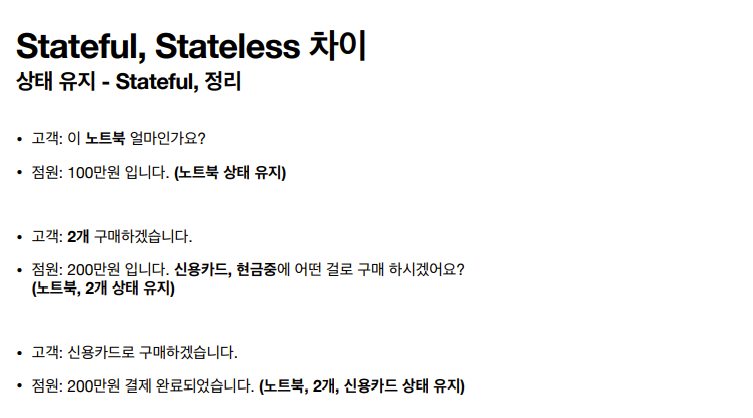
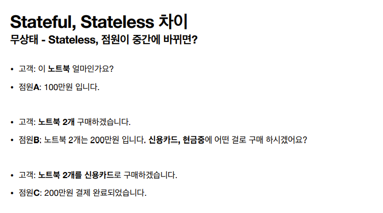
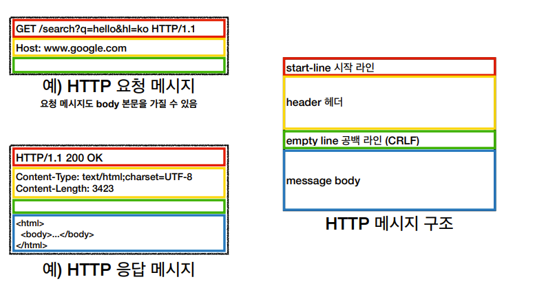

# HTTP 기본

### <b>HTTP(Hyper Text Transfer Protocol)</b>

문서간의 링크를 통해서 HTML을 전송하는 프로토콜로 시작했지만
지금은 HTTP 메시지에 모든 것을 담아서 전송한다.

- HTML, TEXT
- IMAGE, 음성, 영상, 파일
- JSON, XML(API)
- 거의 모든 형태의 데이터 전송 가능
- 서버간에 데이터를 주고 받을 때도 대부분 HTTP를 사용

<br>

<b>1997년에 나온 HTTP/1.1 버전이 가장 많이 사용되며 중요한 버전이다.</b>

기반 프로토콜

- TCP : HTTP/1.1, HTTP/2
- UDP : HTTP/3
- 현재 HTTP/1.1 주로 사용
  - HTTP/2, HTTP/3 도 증가 추세

<br>

### 클라이언트 서버 구조

클라이언트가 HTTP 메시지를 서버에 보내면, 서버가 요청에 대한 결과를 만들어 응답을 할 때까지 대기한 후 동작을 한다.

클라이언트와 서버의 역할을 나누게 되면 각각 독립적인 진화가 가능하다. <br>
클라이언트는 UI 성능 최적화에 집중하고,
서버에서는 복잡한 비즈니스 로직을 처리하는데 집중하면 된다.

<br>

## 무상태 프로토콜

<b>HTTP의 중요한 특징 중 하나는 무상태 프로토콜(Stateless)을 지향한다는 점이다.</b>

<b>Stateless에서 서버는 클라이언트의 상태를 보존하지 않는다.</b>
서버의 확장성이 높은 것이 장점이지만 클라이언트가 추가 데이터를 전송해야한다.

<br>

### Stateful(상태 유지), Stateless(무상태)의 차이




<br>

- <b>상태 유지(stateful)</b>: <u>요청이 있을 때 마다 다른 점원이 응대를 한다면</u> 맥락을 읽지 못해(정보가 불충분) 장애가 발생하게 된다.<br>
  

  - 장애를 방지하려면 중간에 다른 점원으로 바뀔 때 상태 정보를 다른 점원에게 미리 알려줘야하는 어려움이 있다.

  - <b>따라서 상태 유지는 항상 같은 서버가 유지되어야 한다.</b><br>
    <b>중간에 서버가 장애가 나면 클라이언트는 처음부터 다시 요청을 해야한다.</b>

  <br>

- <b>무상태(stateless)</b>: 고객으로부터 응대에 필요한 데이터를 그때 그때 받는다. 중간에 다른 점원으로 바뀌어도 된다.

  - 갑자기 고객이 증가해도 점원을 대거 투입할 수 있다.( => 갑자기 클라이언트 요청이 증가해도 서버를 대거 투입할 수 있다.)

  - 문맥이 필요없기 떄문에 무상태는 아무 서버나 호출이 가능하다.

  - 따라서 서버에 장애가 발생한 경우에도 다른 서버로 연결해서 응답이 가능하다.

<br>

- <b>무상태는 응답 서버를 쉽게 바꿀 수 있다. 이 말은 서버를 무한히 증설할 수 있다는 것이다.</b>

- 하지만 모든 것을 무상태로 설계 할 수는 없다.

  - 예를 들어 상태를 유지할 필요가 없는 서비스 소개화면은 무상태로 설계하기 좋다. 하지만 <b>로그인 기능</b>같은 경우 상태 유지가 필요하다.

  - 일반적으로 브라우저 쿠키와 서버 세션 등을 사용해서 상태를 유지한다.
  - 상태 유지는 최소한만, 꼭 필요한 경우에 사용해야 한다는 것을 유의한다.

<br>

## 비 연결성(connectionless)

다수의 클라이언트와 서버가 연결을 유지하면, 서버 자원은 계속 소모가 된다.

클라이언트와 서버가 필요한 데이터를 주고받은 후 서로 연결을 유지하지 않는다면, 최소한의 서버 자원만을 유지하며 효율적인 운영이 가능하다.

- <b>HTTP는 연결을 유지하지 않는 모델을 기본으로 한다.</b>

- 일반적으로 초 단위 이하의 빠른 속도로 응답한다.

- 1시간 동안 수천명이 서비스를 사용해도 실제 서버에서 동시에 처리하는 요청은 수십개 이하로 매우작다.(웹 브라우저에서 계속 연속해서 검색버튼을 누르지는 않는다.)

- <b>서버 자원을 효율적으로 사용한다.</b>

- 하지만 다시 요청받아서 연결하려면 TCP/IP 연결을 새로 맺어야 한다. => 3 way handshake 시간이 추가된다.

- 웹 브라우저로 사이트를 요청하면 HTML 뿐만 아니라 자바스크립트, CSS, 이미지 등 많은 자원들이 함께 다운로드 되기 때문에 재연결하는 과정이 비효율적이다.

- 지금은 HTTP 지속 연결(Persistent Connections)로 이러한 문제를 해결한다.

- HTTP/2, HTTP/3에서 더 많은 최적화가 되었다.

<br>

## HTTP 메시지



<br>

<b>시작 라인: 요청 메시지 - HTTP 메서드</b>

- 종류: GET, POST, PUT, DELETE...

- 서버가 수행해야 할 동작 지정

  - GET: 리소스 조회
  - POST: 요청 내역 처리

  <br>

- absolute-path[?query] (절대경로[?쿼리])

  - 절대경로는 "/" 로 시작하는 경로

<br>

- HTTP 버전

- HTTP 상태 코드: 요청 성공, 실패를 나타냄

  - 200: 성공
  - 400: 클라이언트 요청 오류
  - 500: 서버 내부 오류

  <br>

- 이유 문구: 사람이 이해할 수 있는 짧은 상태 코드 설명 글

<br>

<b>HTTP 헤더</b>

- HTTP 전송에 필요한 모든 부가 정보

  - 메시지 바디의 내용과 크기, 압축, 인증, 요청 클라이언트 정보, 서버 애플리케이션 정보, 캐시 관리 정보...

  ```
  Content-Type:text/html;charset=UTF-8
  Content-Length: 3423
  ```

  <br>

- <b>field-name ":"</b> OWS <b>field-value</b> OWS (OWS = 띄어쓰기 허용)

  ```
  Host: www.google.com
  ```

- field-name은 대소문자 구분 없음(value는 구분함)

- 표준 헤더 필드는 매우 많음

- 필요시 임의의 헤더 추가 가능

<br>

<b>HTTP 메시지 바디</b>

- 실제 전송할 데이터

- HTML 문서, 이미지, 영상, JSON 등등 byte로 표현할 수 있는 모든 데이터 전송 가능

<br>
<hr>
<a href="https://www.inflearn.com/course/http-웹-네트워크/dashboard">인프런 김영한님의 모든 개발자를 위한 HTTP 강의</a> 로 공부한 내용입니다.
