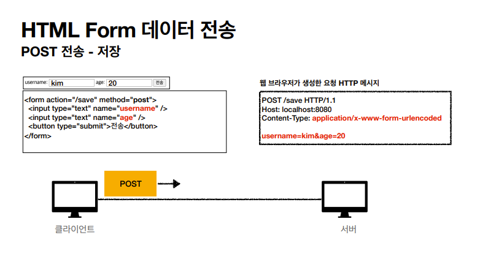
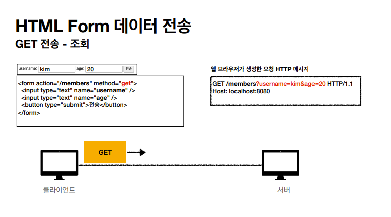
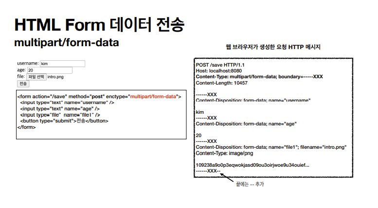

# HTTP 메서드 활용

## 클라이언트에서 서버로 데이터 전송

 

<i>데이터의 전달 방식은 크게 2가지가 있다.</i>

- <b>[쿼리 파라미터](https://github.com/leejaypower/TIL/blob/main/HTTP/인터넷_네트워크.md#url-문법)를 통한 데이터 전송</b>

  - GET
  - 주로 정렬 필터(검색어)

   

- <b>메시지 바디를 통한 데이터 전송</b>

  - POST, PUT, PATCH
  - 회원 가입, 상품 주문, 리소스 등록, 리소스 변경

 
 

<i>다음은 서버로 데이터 전송을 할 때 4가지 상황예시이다.</i>

### 정적 데이터 조회

- 이미지, 정적 텍스트 문서

- 조회니까 GET 사용

- 일반적으로 쿼리 파라미터 없이 리소스 경로로 단순하게 조회 가능

 

### 동적 데이터 조회

- 주로 검색, 게시판 목록에서 정렬 필터(검색어)

- 조회 조건을 줄여주는 필터, 조회 결과를 정렬 조건에 주로 사용

- 조회니까 GET 사용

- GET은 쿼리 파라미터를 사용해서 데이터를 전달

 

### HTML Form을 통한 데이터 전송(GET, POST만 지원)

- 회원 가입, 상품 주문, 데이터 변경

- form을 submit하면 웹 브라우저는 form의 데이터를 읽어서 HTTP 메시지를 생성한다.

- method가 POST이면 메시지 바디를 통해(key=value) 전송, GET이면 URL 경로에 쿼리 파라미터 형식을 통해 전송한다.

   
   

    

- POST 전송 예) 회원 가입, 상품 주문, 데이터 변경

  - Content-Type: application/x-www-form-urlencoded 사용

  - 전송 데이터를 url encoding 처리 예) abc김 -> abc%EA%B9%80

   

- Content-Type : multipart/form-data

  

  - 파일 업로드 같은 바이너리 데이터 전송시 사용

  - 다른 종류의 여러 파일과 폼의 내용 함께 전송 가능(multipart)

    

### HTTP API를 통한 데이터 전송

- 클라이언트에서 서버로 데이터를 바로 전송하는 것을 보통 HTTP API 데이터 전송이라고 부른다.

- 회원 가입, 상품 주문, 데이터 변경

- 서버 to 서버(백엔드 시스템 통신), 앱 클라이언트(아이폰, 안드로이드), 웹 클라이언트(Ajax)

- POST, PUT, PATCH: 메시지 바디를 통해 데이터를 전송

- GET: 조회, 쿼리 파라미터로 데이터 전달

- Content-Type: application/json을 주로 사용

 

## HTTP API 설계

### POST - 신규 자원 등록 특징

- 회원 관리 시스템에서 회원을 등록할 때 일반적으로 POST method를 사용한다.

- 클라이언트는 등록될 리소스의 URI를 모른다.

- 서버가 새로 등록될 리소스 URI를 생성해준다.

  - 예를 들어 새로 등록된 회원의 고유 번호 
    Location:<b>/members/100</b>

   

- 컬렉션(Collection)

  - 서버가 관리하는 리소스 디렉토리

  - 서버가 리소스의 URI를 생성하고 관리

   

### PUT - 신규 자원 등록 특징

- 파일 관리 시스템은 파일을 업로드할 때 만약 기존 파일이 있다면 지우고 새롭게 등록해야한다. 이럴 때는 PUT method를 사용한다.

- 클라이언트가 리소스 URI를 알고 있어야 한다.

  - 파일 이름을 클라이언트가 식별해서 알고 있다. 
    PUT<b>/files/star.jpg</b>

     

- 클라이언트가 직접 리소스 URI를 저장한다.

- 스토어(Store)

  - 클라이언트가 관리하는 리소스 저장소

  - 클라이언트가 리소스의 URI를 알고 관리

 

### HTML FORM 사용

- <b>HTML FORM은 GET, POST만 지원</b>하기 때문에 제약이 있음

- AJAX 같은 기술을 사용해서 해결

- <b>컨트롤 URI</b>

  - 제약을 해결하기 위해 동사로 된 리소스 경로 사용

  - POST /new, /edit, /delete ...

  - 문서, 컬렉션, 스토어로 해결하기 어려운 추가 프로세스 실행

  - HTTP 메서드로 해결하기 애매한 경우 사용

 

<a href="https://www.inflearn.com/course/http-웹-네트워크/dashboard">인프런 김영한님의 모든 개발자를 위한 HTTP 강의</a> 로 공부한 내용입니다.
