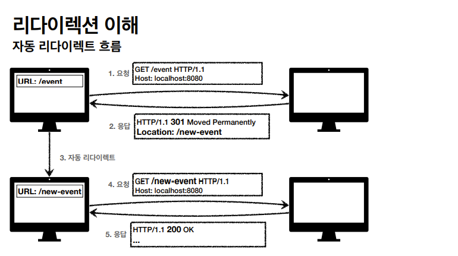
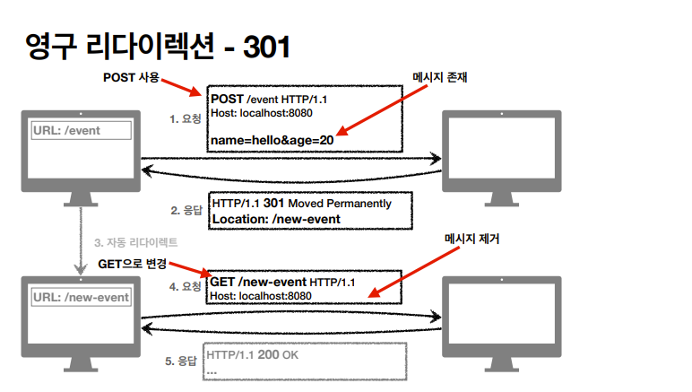
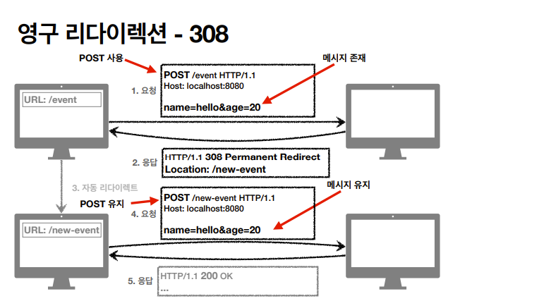
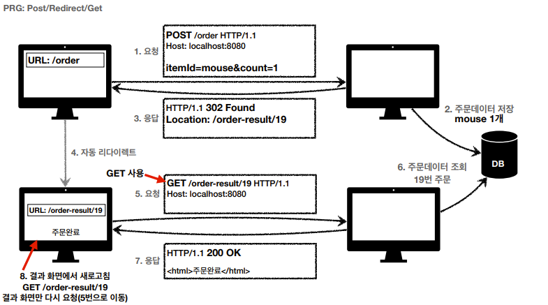

# HTTP 상태코드

HTTP 상태코드는 클라이언트가 서버에 보낸 처리 상태를 응답해서 알려주는 기능이다.

 

### 2xx (Successful) : 클라이언트의 요청을 성공적으로 처리

- 200 OK : 요청 성공
- 201 Created : 요청 성공해서 새로운 리소스가 생성됨

  - 데이터를 POST로 보내서 처리하는 경우 등

     

- 202 Accepted: 요청이 접수되었으나 처리가 완료되지 않았음

  - 배치 처리 같은 곳에서 사용  요청 접수 후 1시간 뒤에 배치 프로세스가 요청을 처리함

   

- 204 No Content : 서버가 요청을 성공적으로 수행했지만, 응답 페이로드 본문에 보낼 데이터가 없음

  - 예) 웹 문서 편집기 save 버튼

  - 결과 내용이 없어도 204 메시지(2xx)만으로 성공을 인식할 수 있다.

 

### Redirection의 이해

웹 브라우저는 3xx 응답의 결과에 Location 헤더가 있으면, Location 위치로 자동이동한다.

 

- <b>영구 리다이렉션(301, 308) : 특정 리소스의 URI가 영구적으로 이동</b> 
  예) /members -> /users

- <b>일시 리다이렉션(302, 307, 303) : 일시적인 변경</b> 
  예) 주문 완료 후 주문 내역 화면으로 이동 
  PRG: Post/Redirect/Get

- 특수 리다이렉션: 결과 대신 캐시를 사용

 

### 3xx (Redirection): 요청을 완료하기 위해 유저 에이전트의 추가 조치 필요

- 300 Mutiple Choices

- 301 Moved Permanently : 리다이렉트시 요청 메서드가 대부분 GET으로 변하고, 본문이 제거될 수도 있음

  

   

- 302 Found : 리다이렉트시 요청 메서드가 대부분 GET으로 변하고, 본문이 제거될 수 있음

- 303 See Other : 리다이렉트시 요청 메서드가 GET으로 명확하게 변경

- 304 Not Modified : 클라이언트에게 리소스가 수정되지 않았음을 알려준다.

  - 클라이언트는 로컬 PC에 저장된 캐시를 재사용한다.(캐시로 리다이렉트한다.)

  - 304 응답은 응답에 메시지 바디를 포함하면 안된다.

  - 조건부 GET, HEAD 요청시 사용

   

- 307 Temporary Redirect : 리다이렉트시 요청 메서드와 본문 유지(요청 메서드를 변경하면 안된다)

- 308 Permanent Redirect: 리다이렉트시 요청 메서드와 본문 유지(처음 POST를 보내면 리다이렉트도 POST 유지) 
  실무에서는 사용하지 않는다. URI가 바뀌면 내부적으로 전달해야하는 데이터 자체가 바뀌기 때문

  

 

### PRG: Post/Redirect/Get

  

 

- POST로 주문 후에 웹 브라우저를 새로고침하면 중복 주문이 될 수 있다.

- 이를 해결하기 위해 POST로 주문 후에 주문 결과 화면을 GET으로 조회한다.

- 새로 고침해도 결과 화면을 GET으로 조회

- 중복 주문 대신 결과 화면만 GET으로 다시 요청

 

### 4xx (Client Error) : 클라이언트 오류

- 클라이언트의 요청에 잘못된 문법등으로 서버가 요청을 수행할 수 없음

- <u>클라이언트가 이미 잘못된 요청, 데이터를 보내고 있기 때문에, 똑같은 재시도가 실패함.</u>

- <b>오류의 원인이 클라이언트에 있음</b>

  - 400 Bad Request : 요청 파라미터가 잘못되거나 API 스펙이 맞지 않을 때

  - 401 Unauthorized : 클라이언트가 해당 리소스에 대한 인증이 필요함

  - 403 Forbidden : 서버가 요청을 이해했지만 승인을 거부함 
    주로 인증 자격 증명은 있지만(로그인) 접근 권한이 불충분한 경우(admin 접근 불가)

  - 404 Not Found : 요청 리소스를 서버에서 찾을 수 없음 
    혹은 클라이언트가 권한이 부족한 리소스에 접근할 때 해당 리소스를 숨기고 싶을 때

 

 

### 5xx (Server Error) : 서버 오류

- 서버에 문제가 있기 때문에 재시도 하면 <b>성공할 수도 있음 (복구 등)</b>

  - 500 Internal Server Error : 서버 내부 문제로 오류 발생

  - 503 Service Unavailable : 서비가 일시적인 과부하 또는 예정된 작업으로 잠시 요청을 처리할 수 없음

 

### 만약 모르는 상태 코드가 나타나면?

- 클라이언트가 인식할 수 없는 상태 코드를 서버가 반환한다면 클라이언트는 상위 상태 코드로 해석해서 처리한다.

- 에를 들어 "299" 라는 코드가 나타나면 "2xx: 요청 정상 처리" 로 해석한다는 뜻이다.

- 미래에 새로운 상태 코드가 추가되어도 클라이언트를 변경하지 않아도 됨

 

<a href="https://www.inflearn.com/course/http-웹-네트워크/dashboard">인프런 김영한님의 모든 개발자를 위한 HTTP 강의</a> 로 공부한 내용입니다.
