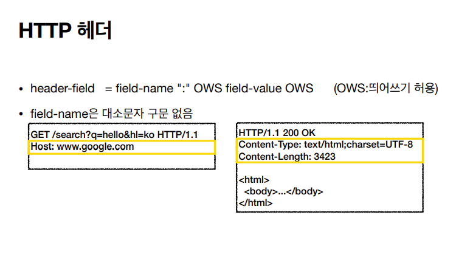
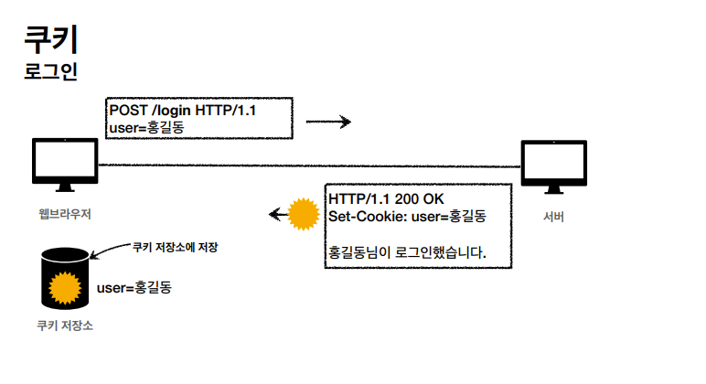
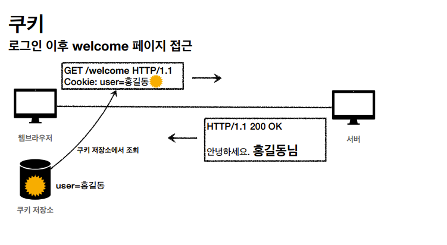
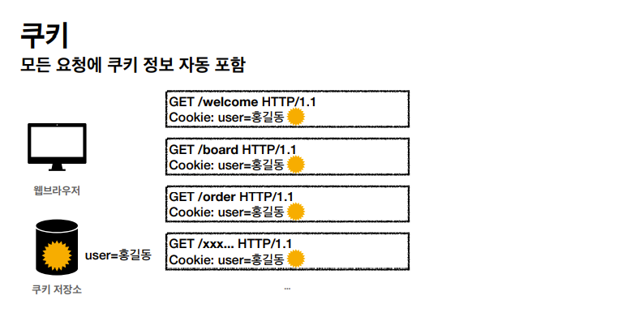

# HTTP 일반 헤더



- HTTP 전송에 필요한 모든 부가정보

  - 메시지 바디의 내용 및 크기, 압축, 인증, 요청 클라이언트, 서버 정보, 캐시 관리 정보

<br>

### 헤더 분류 - RFC2616 과거

- <b>General 헤더</b>: 메시지 전체에 적용되는 정보

  - 예) Connection : close

    <br>

- <b>Request 헤더</b>: 요청 정보(요청을 보낼 때 들어가는 헤더), 예) User-Agent: Mozila/5.0
- <b>Response 헤더</b>: 응답 정보(응답에 들어가는 헤더), 예) Server: Apache
- <b>Entity 헤더</b>: 엔티티 바디 정보, 예) Content-Type: text/html, Countent-Length: 3423

  - 메시지 본문(message body) 엔티티 본문(entity body)를 전달하는데 사용

  - 엔티티 본문은 요청이나 응답에서 전달할 실제 데이터

  - <b>엔티티 헤더는 엔티티 본문의 데이터를 해석할 수 있는 정보 제공</b> - 데이터 유형(html, json), 데이터 길이, 압축 정보 등등

<br>

HTTP 표준으로 2014년 RFC7230~7235가 등장하면서 RFC2616은 폐기된다.

<br>

### RFC723x 변화

- 엔티티(Entity) -> 표현(Representation)

- Representation = representation Metadata + Representation Data
- 표현 = 표현 메타데이터 + 표현 데이터

- 메시지 본문(message body)을 통해 표현 데이터 전달
- 메시지 본문 = 페이로드(payload)
- <b>표현은 요청이나 응답에서 전달할 실제 데이터</b>
- <b>표현 헤더는 표현 데이터를 해석할 수 있는 정보 제공</b> - 데이터 유형(html, json), 데이터 길이, 압축 정보 등등
- <i>표현 헤더는 표현 메타데이터와 페이로드 메시지를 구분해야하지만 이 학습에서는 생략한다.</i>

<br>

### 표현

실제 리소스는 추상적이기 때문에 클라이언트와 서버간 데이터를 주고받을 때는 서로 이해할 수 있게 변환하는 과정이 필요하다. <br>
그 과정에서 데이터를 HTML, JSON, XML 등으로 <b>"표현"</b> 한다.

- <b>Content-Type</b>: 표현 데이터의 형식

  - 미디어 타입, 문자 인코딩(text/html; charset=urf-8, application/json, image/png ...)

  <br>

- <b>Content-Encoding</b> : 표현 데이터의 압축 방식

  - 데이터를 전달하는 곳에서 압축 후 인코딩 헤더 추가

  - 데이터를 읽는 쪽에서 인코딩 헤더의 정보로 압축 해제(gzip, deflate, identity ...)

  <br>

- <b>Content-Language</b>: 표현 데이터의 자연 언어를 표현

  - ko, en, en-US

  - 클라이언트에서 언어를 바꾸는 부가적인 작업을 할 수 있다.

    <br>

- <b>Content-Length</b>: 표현 데이터의 길이

  - 바이트 단위

  - Transfer-Encoding(전송 코딩)을 사용하면 Content-Length를 사용하면 안됨

  <br>

- 표현 헤더는 전송, 응답 둘다 사용

<br>

### 협상(Content negotiation)

클라이언트가 선호하는 표현으로 서버에게 데이터를 달라고 요청하면 서버는 클라이언트가 원하는 우선순위에 맞춰서 표현 데이터를 만든다.

- Accept: 클라이언트가 선호하는 미디어 타입 전달
- Accept-Charset: 클라이언트가 선호하는 문자 인코딩
- Accept-Encoding: 클라이언트가 선호하는 압축 인코딩
- Accpet-Language: 클라이언트가 선호하는 자연 언어

- 협상 헤더는 요청시에만 사용한다.

<br>

예를 들어 다중 언어가 지원되는 서버가 있는데, 이 서버의 기본 언어는 영어이며, 한국어 지원이 가능하다.<br>
클라이언트가 정보를 주지 않으면 기본값인 영어로 브라우저 응답을 해준다.<br>
클라이언트가 한국어 자연 언어를 요청하면 서버는 한국어로 브라우저 응답을 보내게 된다.

<br>

### 협상과 우선순위 - Quality Values(q)

좀 더 복잡한 예시를 보자.<br>
기본 언어가 독일어고 영어가 지원되는 서버가 있고, 클라이언트는 한국어가 요청되지 않는다면 영어로 응답하길 원한다면?

```
GET /event
Accept-Language:ko-KR,ko;q=0.9,en-US;q=0.8,en;q=0.7
```

- Quality Values(q) 값을 사용한다.

- 0과 1사이에서 값이 클수록 높은 우선순위를 가진다.

- 생략하면 1을 가진다.

<br>

```
GET /event
Accept: text/*,text/plain,text/plain;format=flowed,*/*
```

- 구체적인 것(디테일이 많은 것)이 우선한다.

- 즉 다음과 같은 우선순위를 가진다.
  1. text/plain;format=flowed
  2. text/plain
  3. text/\*
  4. \*/\*

<br>

### 전송방식

- 단순 전송 : 요청받은것을 한 번에 응답 하는 것

- 압축 전송 : 용량을 줄여서 압축해서 응답

- 분할 전송 : 데이터의 용량이 클 때 데이터를 쪼개서 응답하는 경우

- 범위 전송 : 중간에 데이터를 받다가 끊겨서 다시 요청하는 경우처럼 범위를 지정해서 요청하면 좋을 때 지정된 범위를 응답한다.

<br>

### 일반 정보

- <b>From</b> : 유저 에이전트의 이메일 정보

  - 일반적으로 잘 사용되지 않음.

  - 검색 엔진 같은 곳에서 주료 사용
  - 요청에서 사용

  <br>

- <b>Referer</b> : 이전 웹 페이지 주소
  </b>

  - 현재 요청된 페이지의 이전 웹 페이지 주소

  - A -> B로 이동하는 경우 B를 요청할 때 Referer: A를 포함해서 요청

  - Referer를 사용해서 유입 경로 분석 가능

  - 요청에서 사용

  - Referer은 단어 referrer의 오타

    <br>

- <b>User-agent</b> : 유저 에이전트(클라이언트)의 애플리케이션 정보(웹 브라우저 정보 등)

  - 통계 정보

  - 어떤 종류의 브라우저에서 장애가 발생하는지 파악 가능

  - 요청에서 사용

  <br>

- <b>Server</b> : 요청을 처리하는 ORIGIN 서버의 소프트웨어 정보

  - HTTP 요청을 보내면 중간에 여러 프록시 서버를 거치게 된다. 실제 요청이 도착해서 응답을 해주는 진짜 서버를 origin 서버라고 한다.

  - 응답에서 사용

  <br>

- <b>Date</b> : 메시지가 발생한 날짜와 시간

  - 응답에서 사용

  <br>

### 특별 정보

- <b>Host</b> : 요청한 호스트 정보

  ```
  GET /search?q=hello&hl=ko HTTP/1.1
  Host: www.google.com
  ```

  - 요청에서 사용

  - <u>필수 정보</u>

  - 하나의 서버가 여러 도메인을 처리해야 할 때<br>(가상의 호스트를 통해 여러 도메인을 한번에 처리할 수 있는 서버가 존재하고, 실제 애플리케이션이 여러개 구동될 수 있다.)

  - 하나의 IP 주소에 여러 도메인이 적용되어 있을 때

<br>

- <b>Location</b> : 페이지 리다이렉션

  - 웹 브라우저는 <a href="https://github.com/leejaypower/TIL/blob/main/HTTP/HTTP상태코드.md#3xx-redirection-요청을-완료하기-위해-유저-에이전트의-추가-조치-필요">3xx 응답의 결과</a>에 Location 헤더가 있으면, Location 위치로 자동 이동(리다이렉트)

  - 201(Created)의 Location 값은 요청에 의해 생성된 리소스 URI이다.

  - 3xx(Redirection)의 Location 값은 요청을 자동으로 리디렉션하기 위한 대상 리소스를 가리킨다.

  <br>

- <b>Allow</b> : 허용 가능한 HTTP 메서드

  - 405(Method Not Allowed)에서 응답에 포함해야 함

  - Allow: GET, HEAD, PUT

  <br>

- <b>Retry-After</b> : 유저 에이전트가 다음 요청을 하기까지 기다려야 하는 시간

  - 503(Service Unavailable) : 서비스가 언제까지 불능인지 알려줄 수 있음

  - 날짜 표기, 초단위 표기 둘다 가능

<br>

### 인증

- Autorization: 클라이언트 인증 정보를 서버에 전달

- WWW-Authenticate: 리소스 접근 시 필요한 인증 방법 정의

<br>

## 쿠키

HTTP는 기본적으로 무상태(Stateless) 프로토콜이다.<br> 클라이언트가 다시 요청하면 서버는 이전 요청을 기억하지 못한다.<br>
클라이언트와 서버는 서로 상태를 유지하지 않는다.<br>
따라서 이를 해결하기 위해 <i>요청에 사용자 정보를 포함하는 대안</i> 을 사용하면, 모든 요청에 사용자 정보가 포함되도록 개발해야하는 어려움이 있다.

<br>





- Set-Cookie : 서버에서 클라이언트로 쿠키 전달(응답)
- Cookie: 클라이언트가 서버에서 받은 쿠키를 저장하고, HTTP 요청 시 서버로 전달

```
예) set-cookie: sessionId=abcde1234; expires=Sat, 22-Mar-2022 00:00:00 GMT; path=/; domain=.google.com; Secure
```

- <b>쿠키의 사용처 : 사용자 로그인 세션 관리, 광고 정보 트래킹</b>

  - 사용자의 정보를 cookie에 그대로 응답하는 것은 위험하다.<br>
    때문에 로그인이 성공되면 서버는 세션 키를 만들어서 DB에 저장을 해놓고, 그 값을 클라이언트에 반환해준다.<br>
    클라이언트는 서버에 요청할 때마다 세션 아이디를 보낸다. 서버는 세션 아이디를 받고 사용자가 누군지 식별하여 응답한다.

  <br>

- <b>쿠키 정보는 항상 서버에 전송됨</b>

  - 네트워크 트래픽 추가 유발

  - 최소한의 정보만 사용(세션 id, 인증 토큰)

  - 서버에 전송하지 않고, 웹 브라우저 내부에 데이터를 저장하고 싶으면 웹 스토리지(localStorage, sessionStorage)를 사용

  - <b>보안에 민감한 데이터는 쿠키에 저장하면 안된다.(주민번호, 신용카드 번호 등)</b>

- expires : 만료일이 되면 쿠키는 자동으로 삭제된다.

- max-age : 초 단위로 쿠키의 생명주기를 설정할 수 있다.

  - 0이나 음수를 지정하면 쿠키가 삭제된다.

  <br>

- 세션 쿠키: 만료 날짜를 생략하면 브라우저 종료시까지만 유지

- 영속 쿠키: 만료 날짜를 입력하면 해당 날짜까지 유지

- <b>쿠키에 도메인을 지정할 수 있다.</b>

  - 명시 : 명시한 문서 기준 도메인 + 서브 도메인 포함<br>
    예) domain=example.org를 지정해서 쿠키 생성 -> example.org와 dev.example.org도 쿠키 접근

  - 생략 : 현재 문서 기준 도메인만 적용<br>
    예) example.org에서만 쿠키 접근. dev.example.org는 쿠키 미접근

  <br>

- <b>쿠키에 경로를 지정할 수 있다.</b>

  - 예) path=/home<br>
    <u>이 경로를 포함한 하위 경로 페이지만 쿠키 접근

  - 일반적으로 path=/ 루트로 지정</u>

  <br>

<b>쿠키와 관련된 보안은 Secure, HttpOnly, SameSite가 있다.</b>

- Secure

  - 쿠키는 http, https를 구분하지 않고 전송

  - Secure를 적용하면 https인 경우에만 전송

  <br>

- HttpOnly

  - XSS 공격 방지

  - 자바스크립트에서 접근 불가(document.cookie)

  - HTTP 전송에만 사용

  <br>

- SameSite

  - XSRF 공격 방지

  - 요청 도메인과 쿠키에 설정된 도메인이 같은 경우만 쿠키 전송할 수 있게 함

  - 비교적 최근에 기능이 적용되어서 사용할 경우에는 브라우저 지원을 확인해야 한다.

<br>
<hr>
<a href="https://www.inflearn.com/course/http-웹-네트워크/dashboard">인프런 김영한님의 모든 개발자를 위한 HTTP 강의</a> 로 공부한 내용입니다.
