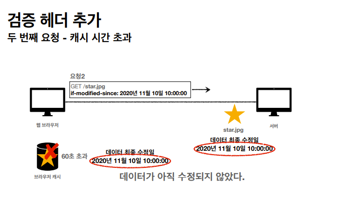
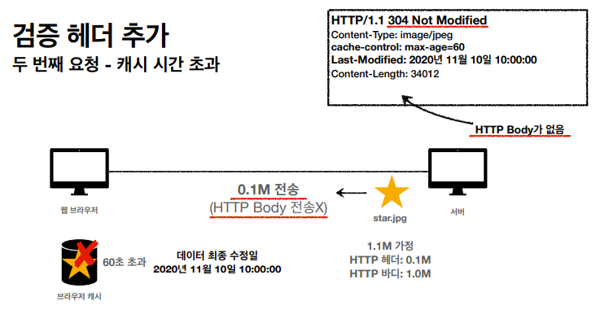
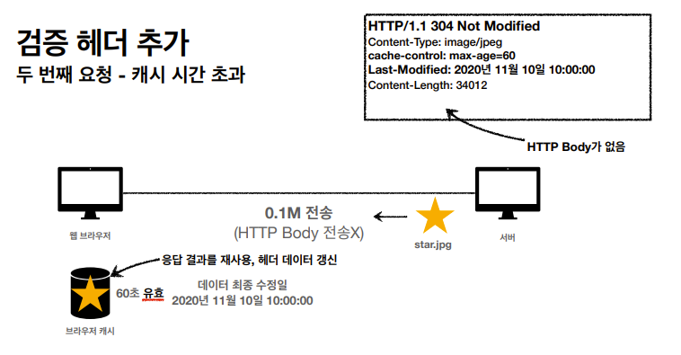
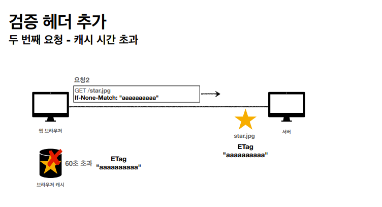
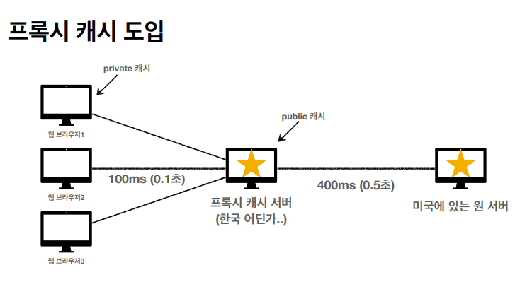
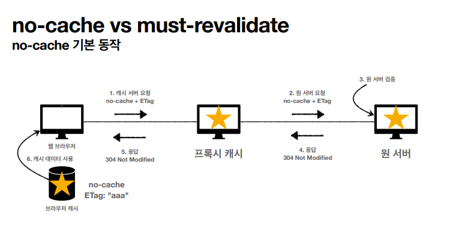
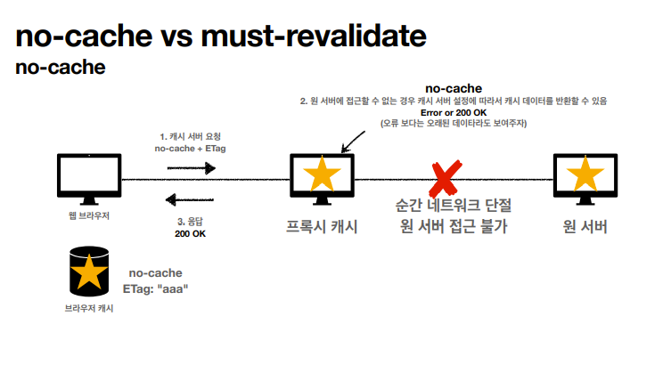
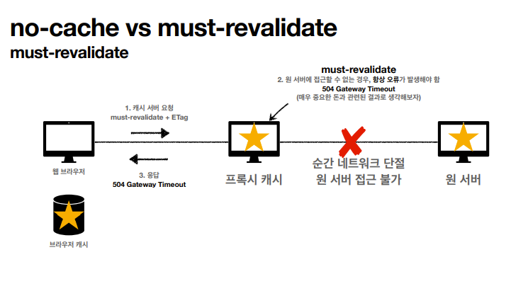

# HTTP 헤더 - 캐시와 조건부 요청

## 캐시 기본 동작

- 캐시가 없을 때

  - 똑같은 요청을 여러번 해야할 경우, 서버는 요청이 들어올 때마다 데이터를 넘겨준다.

  - 데이터가 변경되지 않아도 계속 네트워크를 통해서 데이터를 다운로드 받아야 한다.

  - 인터넷 네트워크는 매우 느리고 비싸다.

  - 브라우저 로딩 속도가 느리다.

  - 느린 사용자 경험

<br>

- 캐시 적용

  - 최초로 요청한 이후 응답 결과를 웹 브라우저 캐시 저장소에 유효 시간동안 저장한다.

  - 다시 요청이 들어온 경우, 캐시 저장소에 관련 데이터를 찾아보고 있으면 가져온다.

  - 캐시 덕분에 캐시 가능 시간 동안 네트워크를 사용하지 않아도 된다.

  - 비싼 네트워크 사용량을 줄일 수 있다.

  - 브라우저 로딩 속도가 매우 빠르다.

  - 빠른 사용자 경험

<br>

- 캐시 적용 - 캐시 시간 초과

  - 캐시 유효 시간이 만료되면, 서버를 통해 데이터를 다시 조회하고 캐시를 갱신한다.

  - 이 때 다시 네트워크 다운로드가 발생한다.

<br>

<br>

## 검증 헤더와 조건부 요청

캐시 유효 시간이 초과해서 서버에 다시 요청하면 다음 두 가지 상황이 나타난다.

1. 서버에서 기존 데이터를 변경함

2. 서버에서 기존 데이터를 변경하지 않음

기존 데이터가 변경되지 않아 똑같은 파일을 유효 시간이 만료되어 다시 받아야 한다면 좋지 않다.

<b>클라이언트의 데이터와 서버의 데이터가 같다는 사실을 확인할 수 있는 방법만 있다면, 서버가 데이터를 다시 전송하는 대신에 저장해 두었던 캐시를 재사용할 수 있다.</b>

<br>

- <b>검증 헤더</b>

  - 캐시 데이터와 서버 데이터가 같은지 검증하는 데이터

  - Last-Modified, ETag

  <br>

- <b>조건부 요청 헤더</b>

  - 검증 헤더로 조건에 따른 분기

  - If-Modified-Since, If-Unmodified-Since: Last-Modified 사용

  - If-None-Match: ETag 사용

  - 조건이 만족하면 200 OK (데이터 변경), 모든 데이터 전송

  - 조건이 만족하지 않으면 304 Not Modified (데이터 미변경), 헤더 데이터만 전송

  <br>

### 검증 헤더 추가

- <b>데이터가 마지막에 수정된 시간을 헤더에 넣어둔다.</b>

  ```
  Last-Modified: 2022년 3월 22일 00:00:00
  ```

- 브라우저 캐시 저장소는 응답 결과를 캐시에 저장한다.

- 캐시 저장소에는 데이터 최종 수정일과 유효시간이 함께 저장되어 있다.

- 캐시가 유효시간이 지나서 브라우저가 다시 요청을 보낼 때 데이터 최종 수정일이 있다면 그 값까지 서버에 넘긴다.

  ```
  if-modified-since:2022년 3월 22일 00:00:00
  ```

- 서버에서 그 요청을 받으면 데이터 최종 수정일을 비교해서 서버에서 수정여부를 서버에서 검증할 수 있다.

   
   

- <b>캐시 유효 시간이 초과해도, 서버의 데이터가 갱신되지 않으면 304 Not Modified + 헤더 메타 정보만 응답한다.</b>

- 수정된 것이 없기 때문에 HTTP Body가 없다.<br>
  <b>헤더만 만들어서 보내기 때문에 용량이 절약되고 네트워크 부하가 줄어들게 된다.</b>

    

    <br>

- 클라이언트는 서버가 보낸 응답 헤더 정보로 캐시의 메타 정보를 갱신하고, 결과적으로 캐시에 저장되어 있는 데이터를 재활용하게 된다.

  <br>

### Last-Modified, If-Modified-Since 단점

- 1초 미만 단위로 캐시 조정이 불가능

- 날짜 기반의 로직 사용

- 데이터를 수정해서 날짜가 다르지만, 최종적으로 데이터 결과가 똑같은 경우

- 서버에서 별도의 캐시 로직을 관리하고 싶은 경우

  - 스페이스나 주석처럼 크게 영향이 없는 변경에서 캐시를 유지하고 싶은 경우

  - ETag를 통해 해결

<br>

### ETag(Entity Tag)

- 캐시용 데이터에 임의의 고유한 버전 이름을 달아둠

  - 예) ETag: "v1.0", ETag: "a2jiodwjekji3"

<br>

- 데이터가 변경되면 이 이름을 바꾸어서 변경함(Hash를 다시 생성)

  - 파일을 해시 알고리즘에 넣어서 해시 결과를 받는다.

  - 파일 콘텐츠가 똑같은 경우 똑같은 해시값을 받지만, 조금이라도 달라지면 다른 해시값을 받는다.

  <br>

- 단순히 ETag만 보내서 같으면 유지, 다르면 다시 데이터를 받는다.

    

<br>

- If-Match, If-None-Match: ETag 값 사용

- <b>캐시 제어 로직을 서버에서 완전히 관리</b>

- 클라이언트는 단순히 이 값을 서버에 제공(클라이언트는 캐시 메커니즘을 모름)

  - 예) 애플리케이션 배포 주기에 맞추어 ETag 모두 갱신

<br>

## 캐시 제어 헤더

- <b>Cache-Control : 캐시 제어</b>

  - max-age : 캐시 유효시간, <b>초 단위</b>

  - no-cache : 데이터는 캐시해도 되지만, 항상 origin 서버(프록시 서버X)에 검증하고 사용

  - no-store: 데이터에 민감한 정보가 있으므로 저장하면 안됨(메모리에서 사용하고 최대한 빨리 삭제)

  <br>

- Pragma: 캐시 제어(하위 호환)

  - no-cache

  - HTTP 1.0 하위 호환 -거의 사용하지 않음

  <br>

- Expires: 캐시 유효 기간(하위 호환)

  - 캐시 만료일을 정확한 날짜로 지정

  - HTTP 1.0부터 사용

  - 지금은 더 유연한 초단위인 Cache-Control : max-age 권장

  - max-age와 함께 사용하면 Expires는 무시된다.

<br>

## 프록시 서버

한국에 있는 브라우저에서 미국에 있는 원 서버(origin)서버에 접근한다고 생각해보자.

거리가 멀기 때문에 시간이 비교적 오래 걸린다.

그 중간에 프록시 캐시 서버를 두어 요청이 오면, 원 서버에 직접 접근하는 것이 아니라 프록시 캐시 서버를 거치게 된다.



- 최초 요청 시에는 캐시 서버가 없어서 비교적 느리다.

- 최초 요청 이후에는 캐시가 생겨서 빨리 조회할 수 있다.

- 중간에서 공용으로 사용하는 캐시 서버는 public 캐시, 웹 브라우저나 local에 저장되는 캐시를 private 캐시라고 한다.

<br>

### Cache-Control 기타 캐시 지시어

- Cache-Control : public

  - 응답이 public 캐시에 저장되어도 됨

<br>

- Cache-Control : private

  - 응답이 해당 사용자만을 위한 것, private 캐시에 저장해야 함(기본값)

  - 사용자 정보와 같은 민감 정보는 무조건 private 캐시에 저장해야 한다.

  <br>

- Cache-Control: s-maxage

  - 프록시 캐시에만 적용되는 max-age

  <br>

- Age: 60(HTTP 헤더)

  - origin 서버에서 응답 후 프록시 캐시 내에 머문 시간(초)

<br>

## 캐시 무효화

### Cache-Control 확실한 캐시 무효화 응답

캐시를 적용안하면 캐시가 저장되지 않는 것이 아니다.

웹 브라우저가 GET 요청인 경우 임의로 저장해버린다.

<br>

- Cache-Control : no-cache, no-store, must-revalidate

- no-cache : 데이터는 캐시해도 되지만, 항상 origin 서버(프록시 서버X)에 검증하고 사용

- no-store: 데이터에 민감한 정보가 있으므로 저장하면 안됨(메모리에서 사용하고 최대한 빨리 삭제)

- must-revalidate

  - <b>캐시 만료 후 최초 조회시 원 서버(origin server)에 검증해야함</b>

  - 원 서버 접근 실패시 반드시 오류가 발생해야함 - 504(Gateway Timeout)

  - must-revalidate는 캐시 유효 시간이라면 캐시를 사용함

  <br>

- Pragma: no-cache

  - HTTP 1.0 하위 호환

  <br>

### no-cache VS must-revalidate

캐시 서버에 no-cache로 요청을 해서 프록시 캐시에서 원 서버로 검증을 나가야 할 때, 원 서버가 순간 네트워크가 단절되어 접근 불가한 경우라면?

  
  

- 캐시 서버 설정에 따라서 데이터를 반환할 수 있다.(Error or 200 OK)

- 오류보다는 오래된 데이터라도 보여주는 것을 선택한 경우 200으로 응답할 수도 있다.

<br>



- 하지만 no-cache와 달리 must-revalidate는 원서버에 접근할 수 없는 경우 무조건 오류를 발생시킨다.

- 통장 잔고와 같이 돈이나 금융데이터라면 must-revalidate를 사용할 수 있겠다.

<br>
<hr>
<a href="https://www.inflearn.com/course/http-웹-네트워크/dashboard">인프런 김영한님의 모든 개발자를 위한 HTTP 강의</a> 로 공부한 내용입니다.
