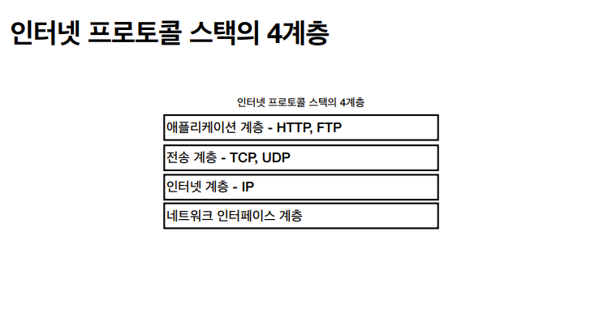
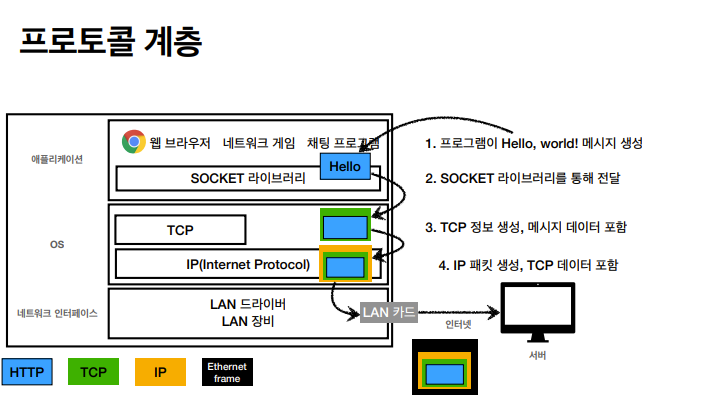
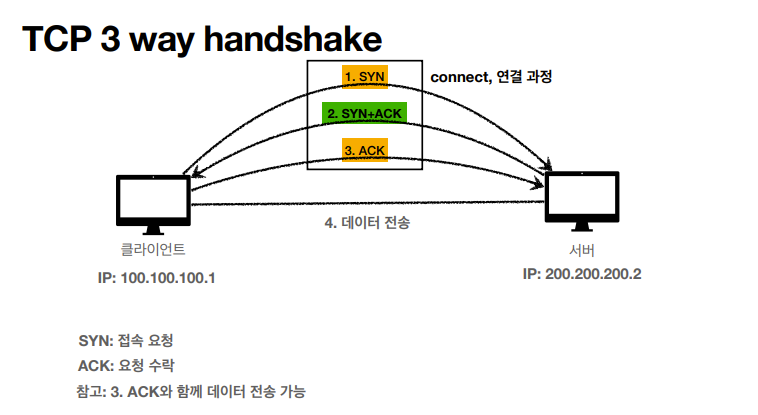
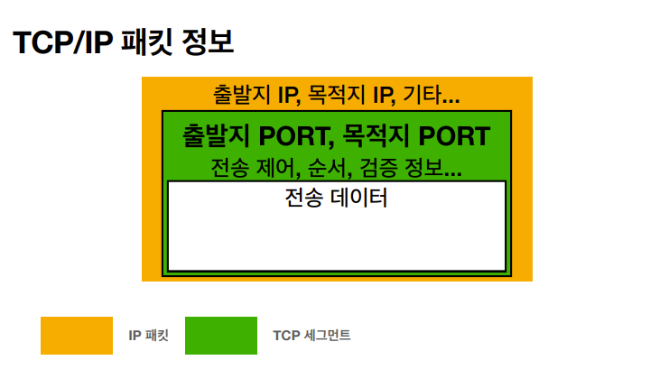
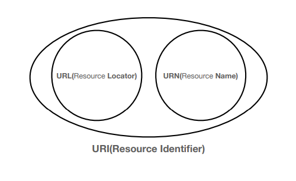
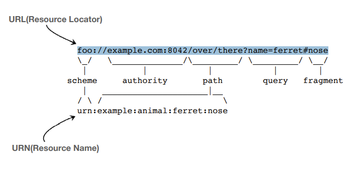
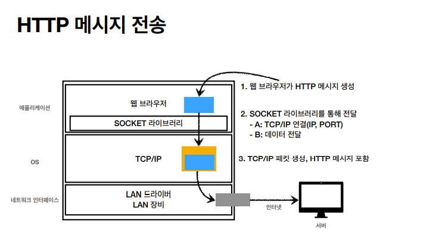

# 인터넷 네트워크

클라이언트에서 데이터를 요청하면 인터넷을 통해서 서버까지 도달해서 데이터를 넘겨준다.

이러한 과정 중간에는 많은 노드(네트워크를 중간에서 연결해주는 서버)들을 거친다.

복잡한 인터넷 망을 헤쳐서 목적지까지 안전하게 도착하기 위해서는 다음과 같은 규칙이 있다.

<br>

## IP 프로토콜

- 클라이언트와 서버는 둘다 IP 주소를 가지고 있다.

- 지정한 IP주소에 <b>패킷(Packet)</b>이라는 통신 단위로 데이터를 전달한다.

  - 패킷은 네트워크에서 데이터를 주고 받을 때 데이터를 나눠서 전송하는 단위이다. 패킷에는 헤더가 있다.

<br>

- IP 패킷의 헤더에는 <b>출발지 IP, 목적지 IP</b> 등의 정보를 담는다.

- 서버들은 규약을 따르고 있기 때문에 헤더의 내용을 이해할 수 있고, 목적지 IP에 도달할때까지 데이터를 넘겨준다.

- 인터넷 망이 복잡하기 때문에 요청할 때와 응답할 때 서로 다른 곳으로 전달될 수도 있다.

<br>

> 패킷 교환방식의 장점

1. 네트워크 리소스 점유 시간이 적다. (나머지 컴퓨터들이 기다리게 되는 문제를 해결)

2. 클라이언트에서 서버로 이동하는 경로가 고정되어 있지 않다. (패킷마다 어떤 경로를 통해 전달될지가 결정되어 있지 않다. 그래서 경로상에 장애가 발생한다 하더라도 다른 경로를 통해 전송하게 되므로 안정성이 높다)

3. 그리고 나누어진 패킷은 순서(넘버링)가 매겨지기에 중간에 유실된 패킷에 대한 재요청이 가능하여 전체 내용을 재전송하지 않아도 되는 것이 장점이다.

<br>

### IP 프로토콜의 한계

- 비연결성

  - IP 프로토콜은 대상 서버가 패킷을 받을 수 있는 상태인지 아닌지 모른다.

  - 패킷을 받을 대상이 없거나 서비스 불능 상태여도 패킷 전송

<br>

- 비신뢰성

  - 중간 서버가 문제가 생겨서 패킷이 유실될 수 있다.

  - 패킷의 용량이 클 경우는 용량을 나눠서 보내는데, 나눠진 패킷들이 중간에 다른 노드를 타게 되면 패킷이 순서대로 오지 않을 수 있다.

<br>

- 프로그램 구분

  - 같은 IP를 사용하는 서버에서 통신하는 애플리케이션이 둘 이상이면 데이터를 구분하기 어렵다.

<br>

## TCP / UDP

IP 프로토콜의 한계점을 TCP/UDP가 해결가능하다.

<br>


<br>

### TCP : 전송 제어 프로토콜

- <b>연결 지향 - TCP 3 way handshake(가상 연결)</b> : 연결을 한 후 데이터를 보냄

  

  - 여기서 연결된 상태는 <u>논리적으로 연결된 상태</u>로, 중간 노드들은 연결상태를 알고 있지 않다.

  - 데이터를 주고 받을 준비가 되어있는지 확인하는 과정이다.

  - 3단계 이전에는 헤더 부분만 전송되고, 이후 헤더 + 데이터가 함께 전송된다.

  <br>

- <b>데이터 전달 보증</b> : 패킷이 중간에 유실된 경우 상태를 알 수 있다.

  - 데이터 전송 성공 여부를 받을 수 있다.

<br>

- <b>순서 보장</b>

  - TCP 세그먼트에는 순서 정보가 들어있기 때문에 클라이언트에게 잘못된 순서부터 다시 전송 요구

  <br>

- <b>신뢰할 수 있는 프로토콜</b>

- <b>현재는 대부분 TCP 사용</b>

<br>

### UDP 사용자 데이터그램 프로토콜(User Datagram Protocol)

- 데이터 전달 및 순서가 보장되지 않지만 <b>단순하고 빠르다.</b>

- IP와 거의 같은 기능을 하지만 <b>PORT, 체크섬</b> 정도가 추가된다.

  - PORT는 하나의 IP에서 여러 종류의 데이터를 받을 수 있게 해준다.

  <br>

- UDP는 애플리케이션(브라우저)에서 추가 작업(handshake 과정, 데이터 순서 보장)이 필요하다. <br>
  크롬 개발자도구-네트워크탭을 통해 과정을 확인할 수 있다.

<br>

## PORT

여러 개의 서버와 통신할 때 주고받는 패킷을 구분하기 위해서 PORT를 사용한다.

한 TCP/IP 패킷 안에는 IP와 PORT의 정보가 둘다 들어있다.
여기서 TCP는 IP위에 얹어진다고 생각하면 된다.



- IP는 목적지 서버를 찾는 것이고, 서버 안에서 돌아가는 애플리케이션을 구분하기 위해서 PORT를 쓰는 것이라 이해하면 된다.

- 즉 PORT는 같은 IP 내에서 프로세스를 구분한다.

- 0 ~ 65535 : 할당 가능
- 0 ~ 1023 : 잘 알려진 포트, 사용하지 않는 것이 좋다.
  - FTP - 20, 21
  - TELNET - 23
  - HTTP - 80
  - HTTPS - 443

<br>

## DNS 도메인 네임 시스템(Domain Name System)

IP는 자리수가 길기 때문에 기억하기 어려우며 변경될 수 있다.
이러한 문제를 해결하기 위해
DNS서버가 존재한다.

<b>DNS는 도메인 명을 IP 주소로 변환 해준다.</b>

DNS서버는 마치 전화번호부처럼 <b>도메인과 IP주소가 연결된 데이터</b>를 저장하고 있다.<br>
따라서 IP주소를 변경하려면 IP주소를 변경 신청해야하며, DNS는 변경된 주소에 맞게 연결시켜준다.

DNS 서버는 주로 회사나 기관에서 운영하며 Google, Cloudflare 등이 있다.

DNS 서버도 상위 서버가 있으며, 찾고자하는 도메인의 IP주소가 없을 경우 상위 서버에 요청한다. 이후 설정한 저장시간이 만료되면 다시 상위 DNS 서버에 요청한다.

<br>
<br>

## URI(Uniform Resource Identifier)

- Uniform: 자원을 식별하는 통일된 방식

- Resource: 자원, URI로 식별할 수 있는 모든 것(제한 없음)

- Identifier: 다른 항목과 구분하는데 필요한 정보

<br>

> URI는 로케이터(locator), 이름(name) 또는 둘다 추가로 분류될 수 있다.





<br>

- URL은 리소스가 있는 위치를 지정

- URN은 리소스에 이름을 부여하는 것
  - 위치는 변할 수 있지만, 이름은 변하지 않는다.
  - URN 이름만으로는 실제 리소스를 찾을 수 있는 방법이 보편화되지 않음
  - 매핑이 어려운 측면이 있어 일반적으로 URL만 사용한다.

<br>

### URL 문법

```
scheme://[userinfo@]host:[port][/path][?query][#fragment]
https://www.google.com:443/search?q=hello&hl=ko
```

- 주로 프로토콜 사용
- 프로토콜(https) : 어떤 방식으로 자원에 접근할 것인가 하는 클라이언트, 서버의 약속 규칙

  - http, https, ftp
  - http는 80포트, https는 443 포트를 주로 사용, 포트는 생략 가능
  - https는 http에 보안 추가 (HTTP Secure)

<br>

- 호스트명(www.google.com)

  - 도메인명 또는 IP 주소를 직접 사용가능하다.

  <br>

- 포트 번호(443)

  - 접속 포트
  - 일반적으로 생략

  <br>

- 패스(/search)

  - 리소스 경로, 계층적 구조
  - 예) /home/file1.jpg<br>
    /members<br>
    /members/100<br>
    /items/iphone12

  <br>

- 쿼리 파라미터(q=hello&hl=ko)

  - key-value 형태
  - ?로 시작, &로 추가 가능 ?keyA=valueA&keyB=valueB
  - query parameter, query string 등으로 불림(웹서버에 제공하는 파라미터, 문자형태)

<br>

- fragment
  - html 내부 북마크 등에 사용
  - 서버에 전송하는 정보 아님

<br>

- userinfo
  - URL에 사용자정보를 포함해서 인증
  - 거의 사용하지 않음

<br>

## 웹 브라우저의 요청 흐름

위의 URL 문법을 지켜서 전송하면 브라우저는 DNS서버를 조회해서 IP를 얻어낸 후, HTTP 요청 메시지를 생성한다.

```
* HTTP 요청 메시지 예시
 GET /search?q=hello&hl=ko HTTP/1.1
 Host: www.google.com
```



- 서버와 연결이 되면 데이터를 HTTP 메시지가 포함된 TCP/IP 패킷을 생성한다.

- 패킷 안에는 출발지 목적지 IP, PORT, 전송 데이터(HTTP 메시지) 등이 들어있다.

- 수많은 인터넷 노드를 통해서 목적지 서버까지 요청패킷이 전달된다.

- 서버는 받은 HTTP 메시지를 해석하고 응답 패킷을 전달한다.

- 웹 브라우저는 받은 데이터를 화면에 렌더링한다.

<br>
<hr>
<a href="https://www.inflearn.com/course/http-웹-네트워크/dashboard">인프런 김영한님의 모든 개발자를 위한 HTTP 강의</a> 로 공부한 내용입니다.
