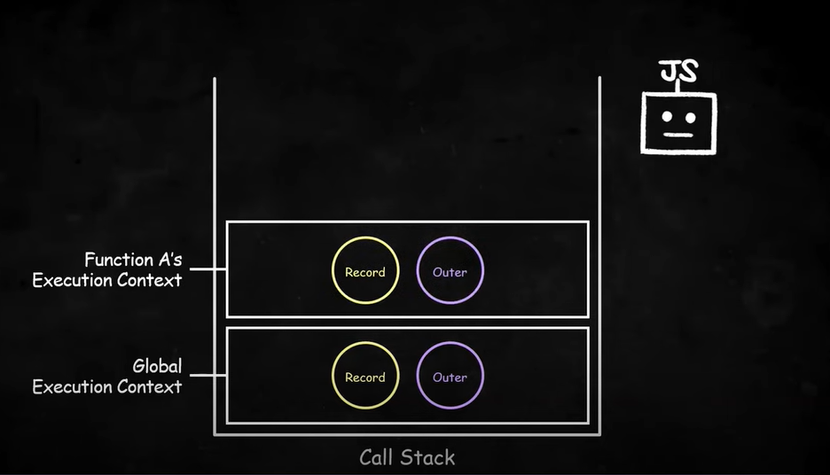
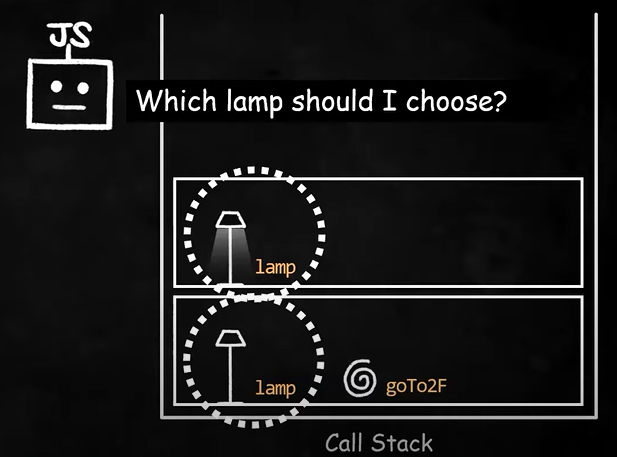
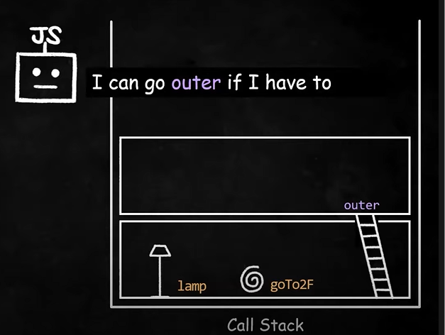
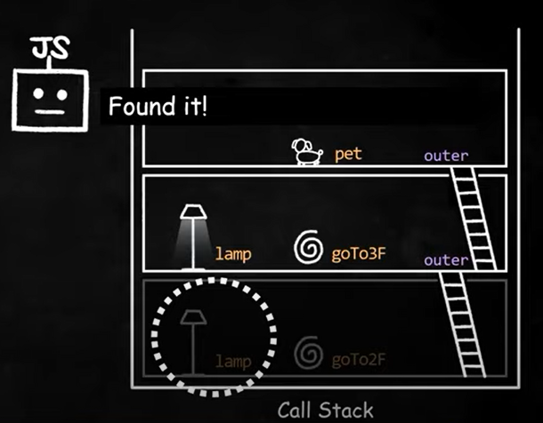

# 실행 컨텍스트

> <b>실행 컨텍스트(execution context)는 자바스크립트의 동작원리를 담고 있는 핵심 개념이다.</b><br>실행 컨텍스트를 바르게 이해하면 자바스크립트가 <b>스코프를 기반으로 식별자와 식별자에 바인딩 된 값을 관리하는 방식과 호이스팅이 발생하는 이유, 클로저의 동작 방식, 그리고 태스크 큐와 함꼐 동작하는 이벤트 핸들러와 비동기 처리의 동작 방식</b>을 이해할 수 있다.

<br>

> <b>실행 컨텍스트: 코드를 실행하는데 필요한 환경(조건이나 상태)을 제공하는 객체이자 식별자 결정을 더욱 효율적으로 하기 위한 수단</b>

<br>

<i>ES5 이전에는 함수가 호출될 때마다 동적으로 스코프를 생성하고 스코프 체인을 연결했기 때문에 함수가 어디에서 호출되느냐에 따라 스코프가 달라졌다.<br>
하지만 ES5 이후부터 실행 컨텍스트라는 하나의 덩어리로 식별자 결정을 관리하게 되었고, 이를 통해 더 빠르고 효율적으로 식별자 결정이 가능해졌다.</i>

<br>

자바스크립트 엔진은 소스코드를 <b>"평가"</b>하고 <b>"실행"</b>하는 과정으로 나누어 처리한다.

- <u>소스코드를 평가하는 과정</u>에서 자바스크립트 엔진은 먼저
  <b>콜 스택(Call Stack, 실행 컨텍스트 스택이라고도 부른다.)</b>이라는 통에 전역 실행 컨텍스트를 담는다.<br>그리고 선언문만 먼저 실행하여 함수나 변수 식별자를 <b>렉시컬 환경의 환경 레코드(Environment Record)</b>에 담아 놓는다.(미리 기록하는 느낌)

- <u>소스코드를 실행하는 과정</u>에서는 평가하는 과정에서 담았던 선언문을 제외한 코드들이 순차적으로 실행된다.

- 이 때 코드 실행 컨텍스트가 관리하는 스코프, 즉 렉시컬 환경의 환경 레코드에서 변수나 함수를 참조하여 실행에 필요한 정보를 취득한다.

- 실행 과정에서 <u>함수가 호출되면 함수 내부로 진입하여 함수 코드를 평가한다.</u> 이 때 매개변수, 지역변수가 선언된다면 실행 컨텍스트가 관리하는 지역 스코프에 등록된다.

- 함수 코드가 순차적으로 실행된다.(함수 실행 컨텍스트 생성)

- 함수 호출이 종료되면(함수 실행 컨텍스트 제거) 실행하던 코드로 돌아간다.

- 이 후 소스코드의 실행 결과는 환경 레코드에 등록된다.

이러한 과정을 가능하도록 관리하는 것이 실행 컨텍스트의 역할이다.<br>

> <b>실행 컨텍스트는 식별자를 등록하고 관리하는 스코프와 코드 실행 순서 관리를 구현한 내부 메커니즘으로, 모든 코드는 실행 컨텍스트를 통해 실행되고 관리된다.</b>

<br>



- 콜스택에서는 가장 최근에 추가된 실행 컨텍스트만 활성화된다.

- 콜스택 속 최상위에 있는 실행 컨텍스트는 현재 실행 중인 코드의 실행 컨텍스트이다.

- 만약 함수 A에서 함수 B가 호출된다면 함수 B의 실행이 끝나고 실행 컨텍스트가 사라지고 나서 함수 A로 돌아갈 수 있다.

- 실행 컨텍스트는 렉시컬 환경 컴포넌트와 변수 환경 컴포넌트로 구성된다.

- 특정한 상황을 만나면 두 개의 컴포넌트의 내용이 달라지는 경우가 있지만 보통 하나의 동일한 렉시컬 환경을 참조하기에 렉시컬 환경으로 통일해서 공부해보려고 한다.

<br>

## 렉시컬 환경(Lexical Environment)

> 렉시컬 환경은 식별자와 식별자에 바인딩된 값, 그리고 상위 스코프에 대한 참조를 기록하는 자료구조로 실행 컨텍스트를 구성하는 컴포넌트이다.

- 렉시컬 환경은 객체 형태의 스코프를 생성해서 식별자를 키로 등록하고 바인딩 된 값을 관리하는 저장소이다.

- 렉시컬 환경은 다음의 두 개의 컴포넌트로 구성된다.
  - 환경 레코드(Environment Record)
  - 외부 렉시컬 환경에 대한 참조(Outer Lexical Environment Reference)

<br>

## Record로 호이스팅 이해하기

> Environment Record : 환경 레코드 - 식별자와 식별자에 바인딩된 값을 기록해두는 객체이다.

```javascript
console.log(example); // undefined
var example;
example = 1;
console.log(example); // 1;
```

자바스크립트 엔진은 이 예제를 평가와 실행 과정으로 나누어 처리한다.

1. 평가 과정: 변수 선언문을 먼저 실행 - 변수 식별자 example은 환경 레코드에 등록되고 undefined로 초기화된다.

2. 실행 과정: 변수 할당문 실행 - example이라는 변수가 먼저 선언되었는지 확인하는 절차를 거쳐 할당한다.<br> example에 바인딩 된 값을 할당한 값으로 업데이트해서 환경 레코드에 기록된다.

3. 이후 마지막 줄 실행에서 자바스크립트 엔진은 환경 레코드를 참조해서 할당된 값을 콘솔에 나타낸다.

<br>

```javascript
console.log(example); // ?
const example;
example = 1;
console.log(example); // 1;
```

- 변수를 let이나 const 키워드로 선언하고, 선언문 이전에 변수를 참조하게 된다면 error가 발생한다.

- 또한 var는 전역 객체 프로퍼티로 참조되지만 let, const는 그렇지 않고 개념적인 블록 내에 존재하게 된다.

- var는 선언과 초기화(undefined)가 동시에 이루어지지만, let과 const는 선언이 이루어져도 값이 undefined로 초기화되지 않는다. 때문에 할당문 직전까지는 변수에 값이 담기지 않는다. 따라서 값을 읽어올 수 없다.

- let이나 const 키워드로 선언했을 때 선언 이전에 식별자를 참조할 수 없는 구역을 <b>일시적 사각지대</b>라고 부른다.

<br>

```javascript
paint(); // type error

var paint = () => {
  // do paint
};
```

- 자바스크립트 var 키워드에 화살표 함수를 담아 선언문 이전에 실행하려고 한다. <u>여기서 함수는 선언문이 아니라 표현식이라는 것을 유의하자.</u>

- paint 함수 식별자는 환경 레코드에 기록되고 값은 undefined로 초기화된다.

- undefined는 함수와 달리 호출될 수 없기 때문에 type error가 발생한다.

<br>

```javascript
paint(); // reference error

const paint = () => {
  // do paint
};
```

- 같은 함수를 const 키워드로 선언하면 아직 환경 레코드에 기록된 값이 없어서 reference error가 발생한다.

- <b>이처럼 변수에 함수를 담아서 함수를 선언하는 함수 표현식은 변수 호이스팅과 똑같이 동작한다.</b>

<br>

```javascript
paint(); // 에러없이 실행

function paint() {
  // do paint
}
```

- 함수 표현식이 아니라 함수 선언문으로 함수를 선언한 경우

- 자바스크립트 엔진은 함수 선언과 동시에 완성된 함수 객체를 생성해서 환경 레코드에 기록해둔다.

- 함수 선언과 동시에 함수가 생성되기 때문에 선언 전에도 함수를 사용할 수 있다.

<br>

## Outer로 스코프 체이닝 이해하기

> Outer Environment Reference : 외부 환경 참조 - <u>바깥</u> 렉시컬 환경을 가리킨다.

```javascript
let lamp = false; // 꺼진 램프

function goTo2F() {
  let lamp = true; // 켜진 램프

  console.log(lamp);
}

goTo2F();
```

- 함수 선언문이기 때문에 환경 레코드에 함수가 온전히 기록된다.

- 이 함수를 실행하면 새로운 실행 컨텍스트가 실행된다.

- 이후 lamp를 출력하려고 환경 레코드를 lamp를 참조했을 때 두 개의 lamp가 있을 것이다.
  

<br>

> <b>식별자 결정</b>: 코드에서 변수나 함수의 값을 결정하는 것

- 함수의 실행 컨텍스트가 새로 생성되는 시점에서 자바스크립트 엔진은 새롭게 생성된 실행 컨텍스트에 바깥 렉시컬 환경으로 돌아갈 수 있는 outer를 남겨놓는다.

- outer를 통해 필요한 경우 이전 실행 컨텍스트의 환경 레코드 속 식별자도 참조 할 수 있다.
  

<br>

```javascript
function goTo2F() {
  let lamp = true; // 켜진 램프

  function goTo3F() {
    ...
  }
}

goTo3F();

function goTo3F(){
  let pet = "puppy";

  console.log(pet); // puppy

  console.log(cat); // reference error

}
```

- 자바스크립트 엔진은 pet의 값을 결정하기 위해(식별자 결정) 환경 레코드를 참조한다.

- <b>현재 활성화된 실행 컨텍스트의 환경 레코드를 먼저 확인한다.</b>

- 마지막 줄에서 cat이라는 변수를 출력하려고 하는데, 이 cat이라는 변수는 선언된 적이 없다.

- 자바스크립트 엔진은 out가 가리키는 바깥 렉시컬 환경까지 가서 cat의 존재를 찾으려고 한다.

- out를 통해 계속 나가서 찾다가 결국 <b>전역 실행 컨텍스트의 렉시컬 환경까지 가서 찾는다.</b>

- 전역 실행 컨텍스트는 최상위 실행 컨텍스트이기 때문에 cat을 찾는 것을 멈추고 cat이라는 식별자는 없다고 결론내린다.

- 없는 식별자를 참조하려고 했기 때문에 reference error가 발생한다.

> 스코프 체인: 식별자를 결정할 때 활용하는 스코프들의 연결리스트

<br>

```javascript
let lamp = false; // 꺼진 램프

function goTo2F() {
  let lamp = true; // 켜진 램프

  function goTo3F() {
    ...
  }
}

goTo3F();

function goTo3F() {
  console.log(lamp); // on
}
```

- 자바스크립트 엔진은 변수 lamp를 출력하기 위해 값을 찾으려고 한다.

- outer를 통해 goTo2F(2층)까지 내려가 lamp의 값을 찾게 된다.

- lamp의 값을 2층에서 찾았기 때문에 1층으로 내려가서 찾으려고 하지 않는다.

- 2층의 lamp와 1층의 lamp는 식별자가 같기 때문에(이름이 같기 때문에) 1층의 값은 2층, 3층에서도 절대 알수가 없게 된다.

  

> 변수 섀도잉(Variable Shadowing) : 동일한 식별자로 인해 상위 스코프에서 선언된 식별자의 값이 가려지는 현상

<br>
<hr>
공부 자료: <a href="https://www.youtube.com/watch?v=EWfujNzSUmw&list=LL&index=3&t=4s">우아한Tech - 10분 테코톡 : 하루의 실행 컨텍스트</a>, <a href="https://book.naver.com/bookdb/book_detail.nhn?bid=16710547">모던 자바스크립트 Deep Dive</a>
