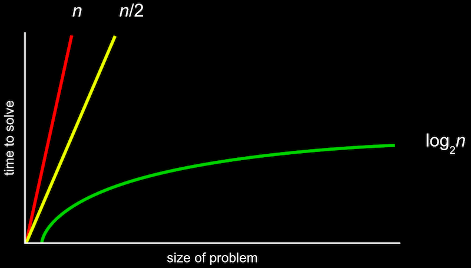

# 알고리즘 표기법

사람들은 한눈에 배열 안에 들어있는 내용물을 전반적으로 파악할 수 있지만, 컴퓨터는 그럴 수 없다. 
컴퓨터에게는 빠르게 전체를 훑어서 파악하는 능력이 없다. 
컴퓨터는 배열 속 내용물을 하나하나씩 봐야한다. 
이것은 <b>알고리즘</b>과 비슷하다.

예를 들어 <b>선형 검색</b>은 시작부터 끝까지 차례대로 검색하는 방법이다. 
<b>이진 검색</b>은 문제를 두갈래로 나눠서 해결할때까지 반복 검색한다. 
분할과 정복 기법또한 이진검색이라 할 수 있다. 
그리고 끝까지 검색했을 때 원하는 결과가 나오지 않으면 <b>false</b>를 반환한다.

 

### Big O 표기법

- 알고리즘은 직선으로 그려지는 선형의 형태이거나
- 좀 더 굴곡이 있거나 로그 형태일 수도 있다.
- 배열의 아이템을 n으로 나타내었다.
- 각각 다른 이 모양은 알고리즘이 <i>최악의 경우 필요한 계산 수</i> 를 나타낸다.
- 즉, Big-O는 <b>알고리즘을 수행하는데 필요한 시간의 상한선</b>을 의미한다.

 

컴퓨터 과학자들은 알고리즘을 설명하기 위해 특정 용어를 사용한다. 
알고리즘이 얼마나 잘 설계되어 있는지, 또 코드가 얼마나 잘 구현되어있는지 말해준다. 

가장 일반적으로 <b>Big-O 표기법</b>을 사용한다. 
이름 그대로 대문자 O로 나타내는데, <i>" on the order of "</i> 의 약자이다.

> 쉽게 생각하면 "~만큼의 정도로 커지는" 것이라고 볼 수 있다.

누군가 당신의 알고리즘이 얼마나 효율적인지 물어본다면,  즉 코드의 효율성을 묻는다면 은유적이면서도 직관적으로 코드의 속도를 대략 알려줄 수 있다.

 

세상에는 다양한 알고리즘이 있는데, 가장 대표적인 실행 시간(프로그램이나 알고리즘이 동작하는데 걸리는 시간)은 이렇다.

- O(n) : O(n)나 O(n/2)는 n만큼 커지므로 n이 늘어날 수록 선형적으로 커지게 된다. - 선형검색
- O(n log n)
- O(n)
- O(log n): 이진검색
- O(1)

 

### Ω(Omega)

<b>알고리즘 수행시간의 하한선</b>을 의미한다. 즉 필요한 계산 수의 최선의 경우이다.

- Ω(n²) : <a href="https://github.com/leejaypower/TIL/blob/main/알고리즘/버블정렬,선택정렬.md">버블 정렬</a>
- Ω(n log n)
- Ω(n)
- Ω(log n)
- Ω(1) : 한번에 찾는 경우 - 선형검색, 이진검색

 

<b>알고리즘의 수행시간의 상한선이 낮은 것이 하한선이 낮은 것보다 좋다.</b> 
최악의 경우에 프로그램이 어떻게 동작할지, 또는 평균적으로 어떻게 동작하는지를 생각해야 하기 때문이다.

 

<a href="https://www.boostcourse.org/cs112">모두를 위한 컴퓨터과학(CS50 2019)</a> - 검색 알고리즘, 알고리즘 표기법으로 공부한 내용입니다.
